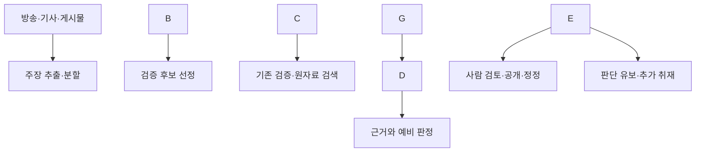
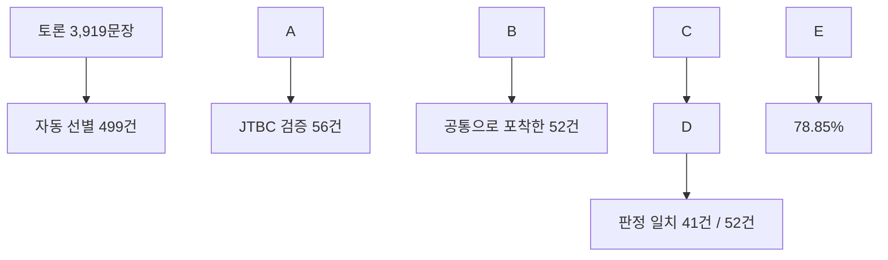

# 거짓이 더 빨리 달리는 시대: 팩트체크와 AI 자동화

**공개 발표용 검증·수정·확장본 · 2026년 9월 24일**  
발표자: 이종혁 · 권장 구성: 발표 40분, 질의응답 10분

이 문서는 제공된 원고의 주장·사례·수치·제도·참고문헌을 대조해 다시 구성한 자료다. 본문에는 APA 저자–연도 인용을 넣고, 말미에 참고문헌과 주요 수정 내역을 수록했다. 사건의 수사 발표는 그 발표 시점의 사실로, 기업의 성능 수치는 기업이 보고한 결과로 서술한다. 공개 자료로 확인할 수 없는 발표자의 개발 현황은 별도로 구분했다. 시점이 다른 통계를 ‘현재 최종치’로 바꾸지 않았다.

## 한 페이지로 보는 핵심

|질문|핵심 답변|
|-|-|
|왜 지금 팩트체크인가?|허위정보는 선거 판단뿐 아니라 건강, 재산, 집단에 대한 폭력, 피해자의 존엄을 해칠 수 있다. 생성형 AI는 기존 음모론에 그럴듯한 음성·사진·신문 지면을 붙이는 수단이 된다.|
|거짓은 정말 더 빨리 퍼지는가?|트위터의 2006–2017년 확산 자료를 분석한 연구에서 거짓 뉴스가 더 빠르고 넓게 퍼졌다. 특정 플랫폼·기간의 결과이므로 모든 정보환경의 불변 법칙으로 말하지 않는다. (Vosoughi et al., 2018)|
|세계적 위험의 어느 정도인가?|WEF의 2026년 보고서에서 허위정보·조작정보는 **향후 2년 위험 2위**다. 전문가 등의 위험 인식 조사이며 실제 피해액 순위가 아니다. (World Economic Forum, 2026)|
|한국의 숫자는 어떻게 읽어야 하나?|2026년 지방선거 관련 딥페이크 게시물 **삭제 요청 10,319건**은 5월 27일까지의 누계다. 제작자 수, 독립된 허위 주장 수, 삭제 완료 건수와 다르다. (안광호, 2026)|
|정치적으로 똑같이 나타나는가?|동일한 검증 기준을 적용해야 하지만 결과가 좌우 대칭일 것이라고 전제해서는 안 된다. 26개국 의원의 트윗을 분석한 연구는 급진우파 포퓰리즘과 저신뢰 정보원 공유의 강한 관련성을 보고했다. (Törnberg \& Chueri, 2026)|
|팩트체크는 효과가 있는가?|여러 나라의 실험에서 잘못된 믿음을 줄였다. 다만 믿음의 교정이 곧바로 투표·공유·행동의 변화까지 보장하지는 않는다. (Porter \& Wood, 2021)|
|AI는 어느 정도인가?|한국어 대선 토론 연구의 **78.85%는 JTBC와 공통으로 다룬 52건에서의 판정 일치율**이다. 자동 선별한 499건 전체의 정확도가 아니다. (이종혁, 2026)|
|가장 현실적인 목표는?|검증할 주장을 더 넓게 찾고, 근거를 모아 사람의 검토를 돕는 것. 공개 판정의 책임, 반론 청취, 정정 절차는 운영 주체가 맡는다.|

## 1부. 허위정보는 무엇을 해치는가

### 1.1 용어부터 정확하게

|용어|구분 기준|설명용 예시|
|-|-|-|
|잘못된 정보·오정보(misinformation)|내용은 틀렸으나, 공유자의 기만 의도가 확인되지 않음|사실로 믿고 잘못된 건강 정보를 가족에게 전달|
|허위조작정보(disinformation)|거짓·오도하는 내용을 고의로 만들거나 유포|상대 후보의 발언을 조작해 실제 발언처럼 공개|
|악의적 정보(malinformation)|실제 정보를 해를 끼칠 목적으로 사용|공개할 공익적 이유 없이 개인의 실제 사적 정보를 유출|
|잘못된 맥락(false context)|실제 사진·영상에 다른 사건의 설명을 부착|예전 재난 사진을 오늘의 사고 현장이라고 공유|
|풍자·패러디|풍자라는 원래 맥락과 수용자의 이해가 중요|풍자 기사의 표시가 잘린 캡처가 사실 보도로 유통|

이 구분은 내용의 진위와 유포 의도를 함께 본다. **옛 사진에 거짓 설명을 붙인 것을 곧바로 malinformation이라고 부르면 안 된다.** 사진 자체가 실제여도 게시물의 주장에는 거짓 맥락이 들어간다. 의도는 별도 증거가 있어야 판단할 수 있다. (Wardle \& Derakhshan, 2017)

WHO가 말하는 **인포데믹**은 감염병 유행 중 정보가 지나치게 많아지는 현상이며, 그 안에 거짓·오도하는 정보가 포함된다. ‘거짓 정보가 전염병처럼 퍼지는 것’만으로 정의하면 범위가 좁아진다. (World Health Organization, n.d.)

‘가짜뉴스’는 풍자, 오보, 광고, 음모론, 불편한 보도를 한데 묶는 말로 쓰이기 쉽다. 검증할 때는 **어떤 문장이 어떤 근거와 충돌하는지**를 구체적으로 지적하는 편이 정확하다.

### 1.2 왜 ‘더 빨리 달리는 시대’인가

Vosoughi 등(2018)은 약 12만 6천 개의 뉴스 확산 사례를 분석해, 거짓 뉴스가 참인 뉴스보다 더 빠르고 멀리 확산되는 양상을 관찰했다. 정치 분야에서 차이가 특히 컸다. 다만 연구 대상은 당시 트위터에서 사실 판정이 가능했던 뉴스 사례다. 이 결과만으로 오늘날 모든 플랫폼이나 모든 이용자가 같은 방식으로 행동한다고 단정할 수는 없다. (Vosoughi et al., 2018)

WEF의 2026년 보고서는 허위정보·조작정보를 2년 전망에서 2위로 제시했다. 같은 보고서의 ‘2026년 당해 위험’, ‘향후 2년’, ‘향후 10년’은 서로 다른 질문이다. AI의 부정적 결과는 2년 전망 30위에서 10년 전망 5위로 높아지지만, 이것 역시 예측된 확정 피해가 아니라 응답자의 위험 인식이다. (World Economic Forum, 2026)

생성형 AI 때문에 새로 점검해야 할 것은 세 가지다. 첫째, 내용뿐 아니라 **발언자·전문가·언론사라는 신원까지 위조**할 수 있다. 둘째, 과거의 음모론을 새 자료처럼 포장할 수 있다. 셋째, 실제 자료도 ‘AI가 만든 것’이라는 말로 부인하기 쉬워진다. 마지막 현상은 ‘거짓말쟁이의 배당’이라는 개념으로 논의되어 왔다. (Chesney \& Citron, 2019)

### 1.3 세계 사례: 피해와 검증 포인트

|사례|확인된 사실|강연에서 강조할 검증 포인트|
|-|-|-|
|이란 메탄올 중독, 2020|연구는 2월 23일–5월 2일 메탄올 중독 입원 5,876건과 법의학기관 집계 사망 800명을 보고했다. 술·소독제가 코로나19를 예방한다는 거짓 믿음이 유행의 배경으로 지적됐다.|**800명 모두가 같은 소문 때문에 사망했다는 인과관계가 개별적으로 입증된 것은 아니다.** 병원 집계 사망 534명과 법의학기관 800명의 집계 범위도 다르다. (Hassanian-Moghaddam et al., 2020)|
|인도 아동 납치 소문과 집단폭행, 2018|WhatsApp 등을 통해 퍼진 납치범 소문과 관련해 행인을 공격해 숨지게 한 사건들이 발생했다. 7월 보도는 32세 남성 사망 사건과 관련한 체포를 전했다.|재난·범죄 영상이 다른 지역의 경고문으로 재포장될 때, 전달자의 선의가 사실 확인을 대신하지 못한다. (Siddiqui, 2018)|
|슬로바키아 선거 직전 조작 음성, 2023|정치인 미할 시메치카와 기자 모니카 토도바가 선거 조작을 논의하는 것처럼 꾸민 음성이 유통됐고 AFP가 조작을 검증했다.|공개 시점, 원본 녹음, 당사자 확인을 함께 확인한다. 이 음성이 선거 결과를 바꾸었다는 인과 효과는 별도 연구 없이는 말할 수 없다. (Barca \& AFP Slovensko, 2023)|
|미국 뉴햄프셔 바이든 사칭 자동전화, 2024|예비선거 직전 바이든의 목소리를 복제한 자동전화가 투표를 미루도록 유도했다. FCC는 관련 불법 자동전화에 대해 정치 컨설턴트에게 600만 달러 과징금을 부과했다.|음성이 익숙하다는 이유로 발신자와 선거 안내를 믿지 않는다. ‘다른 날 투표하라’는 주장은 선거 당국 자료로 확인한다. (Federal Communications Commission, 2024)|
|홍콩 기업 송금 사기, 2024|홍콩 정부는 딥페이크를 이용한 화상회의 사칭 사건에서 직원이 약 **2억 홍콩달러**를 송금했다고 설명했다.|녹화된 합성 회의 자료를 이용한 사건을 ‘모든 참가자가 완전한 실시간 AI로 대화했다’고 확대하지 않는다. 송금 지시는 별도 연락 경로로 확인한다. (Government of the Hong Kong SAR, 2024)|

### 1.4 한국의 징후

#### 선거: 실제로 하지 않은 말을 한 것처럼

2026년 5월 27일 기준 지방선거 관련 딥페이크 게시물 삭제 요청은 10,319건이었다. 2025년 대선의 4월 4일–6월 3일 집계 10,510건과 비교하면 98.2%지만, **관측 기간이 다르므로 발생률의 증가를 계산한 값은 아니다.** 선거별 집계 기준이 다른 2024년 수치와 곧바로 나눠 ‘27배 증가’라고 설명하는 것도 피한다. (안광호, 2026)

울산의 한 예비후보를 미국 시사주간지가 선정했다는 식의 가짜 앵커 영상은, AI가 ‘뉴스 보도 형식’을 빌려 권위를 만드는 사례다. 해당 사례는 후보의 실제 업적 검증과 영상의 합성 여부를 나눠 확인해야 한다. (박순봉, 2026)

공직선거법상 제한도 ‘모든 AI 사용 금지’가 아니다. **선거일 전 90일부터 선거일까지 선거운동을 위해 딥페이크 영상 등을 제작·편집·유포·상영·게시하는 행위**에 관한 규정이다. 그 밖의 기간에는 가상정보 표시 의무와 허위사실 공표 등 다른 규정도 따져야 한다. (중앙선거관리위원회, 2025b)

#### 뉴스 이용: 많이 보는 매체와 신뢰하는 매체는 다르다

2026년 디지털 뉴스 리포트의 한국 자료를 소개한 보도에 따르면 유튜브 뉴스 이용은 49%, 조사 48개 시장 평균은 31%였다. 한국의 뉴스 전반에 대한 신뢰는 30%, 허위정보 우려는 59%, AI 챗봇을 통한 뉴스 이용은 14%로 소개됐다. 각각 **이용·신뢰·우려라는 서로 다른 질문**의 응답 비율이다. 온라인 설문 결과를 한국의 모든 연령대 국민을 직접 전수 조사한 값처럼 설명하지 않는다. (Lee et al., 2026; 이수지, 2026)

특정 플랫폼 이용률만으로 그 플랫폼이 개인의 정치적 극단화를 일으켰다고 결론 내릴 수는 없다. 이용자의 기존 성향, 추천 방식, 이용 시간, 구독 관계 등을 분리해 연구해야 한다.

#### 건강: 가짜 처방과 가짜 전문가

2020년 성남 은혜의강 교회에서는 코로나19 예방을 표방하며 여러 교인의 입에 소금물을 분무한 사실이 확인됐다. 방역당국은 같은 분무기를 사용한 행위가 감염 확산에 영향을 주었을 가능성을 지적했다. **집단감염의 모든 감염 경로가 이 행위로 확정됐다는 서술은 피한다.** (이우성, 2020)

2026년 6월 보도된 가짜 AI 의사 광고 사건에서는 업체가 약 9개월 동안 식품 약 65만 개를 팔아 81억 원의 매출을 올린 혐의가 수사 대상이었다. **81억 원은 보도된 매출액이지, 법원이 확정한 피해액이 아니다.** 가운·청진기·방송 자막은 전문성의 증명이 될 수 없다. (신진호, 2026)

확인할 것은 ‘의사처럼 보이는가’보다 **실존 인물과 소속이 확인되는가, 광고하는 제품의 승인된 용도와 근거는 무엇인가**다. 치료 중단이나 약 변경을 권하는 영상은 담당 의료진과 확인해야 한다.

#### 정치

**사례 A. ‘선거연수원 중국인 99명 체포’ 주장**

2024년 12월 비상계엄과 관련해 중국인 99명이 선거연수원에서 체포됐다는 주장이 확산됐다. 중앙선거관리위원회 설명에 따르면 당시 숙박자는 교육생 88명과 강사 등 8명으로 총 96명이었고, 해당 체포설은 사실이 아니었다. 이 사건에서 검증할 것은 숫자의 그럴듯함이 아니라 **숙박 기록, 출입 여부, 체포 기록, 관계기관 확인**이다. (중앙선거관리위원회, 2025a)

‘중국인 체포’처럼 새로운 주장을 덧붙이는 방식은 기존 부정선거 음모론을 사건 설명의 틀로 만드는 데 쓰일 수 있다. 그러나 반증을 제시했다는 이유만으로 검증 기관까지 ‘한패’라고 몰아가면, 반증으로 수정할 수 없는 주장이 된다. 이 대목은 특정 주장 구조에 대한 분석이며 모든 의혹 제기를 음모론으로 부르는 기준은 아니다.

**사례 B. 선거 의혹을 계엄의 근거로 삼을 수 있는가**

헌법재판소는 2025년 4월 4일 대통령 탄핵 결정에서, 부정선거 의혹만으로 중대한 위기상황이 현실적으로 발생했다고 볼 수 없고 이런 문제는 정치적·제도적·사법적 수단으로 해결해야 한다고 판단했다. 이를 ‘모든 선거의 모든 쟁점을 헌재가 직접 실험해 검증했다’고 확대할 필요는 없다. **보안 취약점의 존재, 실제 침입, 투표 변경, 선거 결과 변경은 각각 별도로 입증해야 하는 주장**이다. (헌법재판소, 2025)

**사례 C. 미국의 2020년 대선 부정 주장과 2021년 1월 6일 의회 공격**

미 하원 조사위원회 최종보고서는 트럼프 측의 선거 부정 주장, 선거 결과를 뒤집으려는 행동, 의회 공격으로 이어지는 사건의 경과를 정리했다. 선거 결과를 받아들이지 않는 정치적 동원에서 반복되는 허위 주장의 역할을 살펴볼 수 있다. 다만 허위정보 하나가 모든 참가자의 행동을 단독으로 결정했다고 설명하지 않는다. (U.S. House of Representatives, 2022)

**사례 D. 사우스포트 사건 뒤 반이민 폭력, 영국 2024년**

아동 살해 사건 직후 범인이 무슬림 망명 신청자라는 거짓 신원 정보가 퍼졌다. 영국 하원 보고서는 이런 온라인 정보가 폭력 선동에 중요한 역할을 했으며, 뒤이은 소요에서 모스크와 망명 신청자 숙소 등이 공격받았다고 정리했다. 정보 공백을 ‘외부 집단이 저지른 범죄’라는 서사로 채우는 위험이 드러난다. (House of Commons Home Affairs Committee, 2025)

**사례 E. ‘아이티 이민자가 반려동물을 먹는다’, 미국 2024년**

트럼프가 대선 토론에서 반복한 오하이오주 스프링필드의 아이티 이민자 관련 주장은 현지 경찰·시 당국 확인과 맞지 않았다. 다른 지역 사진, 미확인 증언, 정치인의 발언을 묶어도 독립된 증거가 되지는 않는다. 이 사례는 반이민 정치에서 **집단에 대한 혐오를 개별 사실 검증보다 앞세우는 방식**을 보여 준다. (Cercone, 2024)

**사례 F. ‘대체’ 음모론과 크라이스트처치 테러**

뉴질랜드 왕립조사위원회는 2019년 모스크 테러를 이해하기 위해 백인우월주의, 반이민·반무슬림 사상, 우익 극단주의와 급진화의 맥락을 검토했다. 인구 변화나 이민 정책에 대한 논쟁과, 특정 집단이 비밀리에 인구를 ‘대체’한다는 음모론을 구분해야 한다. 폭력의 원인은 개인·사회·온라인 환경을 함께 봐야 하며, 음모론을 접한 모든 사람이 폭력으로 향하는 것은 아니다. (Royal Commission of Inquiry, 2020)

**비교연구가 말해 주는 것**

Törnberg와 Chueri의 연구는 26개국 의원의 약 3,200만 개 트윗을 분석해, 급진우파 포퓰리즘과 저신뢰 정보원 공유 사이의 강한 관련성을 보고했다. 일반적인 우파 성향, 포퓰리즘 일반, 좌파 포퓰리즘은 같은 결과를 보이지 않았다. 온라인 선공개는 2025년, 최종 권·호 출판은 2026년이므로 이 문서에서는 2026년으로 인용한다. (Törnberg \& Chueri, 2026)

이 연구가 모든 게시물의 거짓 여부와 작성자의 의도를 직접 판정한 것은 아니다. 정보원 수준의 측정과 관찰자료의 한계가 있다. 그럼에도 **같은 검증 기준을 적용한다는 원칙과, 모든 정치집단이 같은 양의 허위정보를 퍼뜨린다는 주장은 다르다.** 이 강연에서 ‘극우’는 특정 조직·사상·행위를 자료에 근거해 설명하는 말로 사용하며, 보수 성향 전체의 동의어로 쓰지 않는다.

#### 역사와 참사: 기록을 바꾸고 피해자를 다시 공격하기

**5·18 가짜 신문 지면.** 2026년에는 1980년 5월의 실제 신문처럼 꾸민 합성 지면이 유통됐고, 최초 제작·유포자로 지목된 인물이 검거됐다. 중요한 검증 단서는 **그 지면에 쓰인 ‘광주일보’ 제호가 1980년 5월에는 존재하지 않았다는 점**이다. 오래된 종이 질감이나 활자 모양보다 당시 제호·발행일·도서관 소장본을 대조하는 것이 강하다. 검거 보도를 최종 유죄 판결로 바꾸어 쓰면 안 된다. (김혜인, 2026; 박기웅, 2026)

**북한군 개입설과 실명 피해.** 지만원이 5·18 시민들을 북한군으로 지목한 발언 등과 관련해 2023년 징역 2년이 확정됐다. 역사 전체에 대한 추상적 의견만의 문제가 아니라, 사진 속 실제 시민의 신원을 왜곡해 명예를 훼손한 사건이라는 점이 중요하다. (차지욱, 2023)

2024년 4월 공개된 조사 결과를 보도한 뉴시스에 따르면, 5·18민주화운동진상규명조사위원회는 지만원이 제시한 북한군 침투의 42개 근거를 분석해 사실무근이거나 왜곡된 주장이라고 결론 내렸다. 사진의 일부 얼굴 특징만 비교한 인물 동일시, 면장갑을 군사용 장갑으로 해석한 주장, 시민의 무기 사용을 북한군의 증거로 간주한 추론 등이 검토됐다. 사진 촬영 시점·각도·조명과 당시 예비군 경험을 빼고 해석하면 실제 시민을 외부 침투자로 바꾸어 놓을 수 있다. (이영주, 2024)

|자료|확인하는 대상|읽는 방법|
|-|-|-|
|2023년 대법원 확정판결 관련 보도|특정 시민의 신원을 왜곡한 발언 등의 형사책임|판결이 다룬 피고인·피해자·행위를 특정한다. (차지욱, 2023)|
|2024년 진상규명조사위 보고서 공개 보도|북한 특수군 침투를 뒷받침한다는 개별 근거|사진 판독, 군사 지식, 현장 기록을 어떤 방식으로 대조했는지 본다. (이영주, 2024)|

국가 조사와 판결은 서로 다른 절차다. 이 사례의 교훈은 권위 있는 기관의 이름만 나열하는 데 있지 않고, **‘사진 속 시민이 북한군’이라는 주장을 어떤 자료로 반박했는지 보여 주는 것**이다.

**참사 피해자에 대한 반복 게시.** 2026년 5월 경찰은 세월호·이태원·제주항공 참사 희생자와 유족을 겨냥한 허위·모욕 글 약 3천 건을 올린 혐의로 50대가 구속됐다고 발표했다. 이 수치는 한 피의자에 대한 수사 내용이지 참사 관련 게시물 전체의 통계가 아니다. (조성하, 2026)

**일본군 ‘위안부’ 피해 부정.** 2026년 6월 11일 시행된 개정법은 일본군 ‘위안부’ 피해에 대한 허위사실을 정해진 방법으로 유포하는 행위의 처벌 근거를 마련했다. 최고 형량은 징역 5년 또는 벌금 5천만 원이며, 예술·학문·연구·보도 등 정당한 목적의 활동에는 예외가 있다. 단순 모욕, 추모물 훼손, 허위사실 유포의 법적 요건을 같은 것으로 설명하지 않는다. (성평등가족부, 2026)

**AI와 홀로코스트 기억.** UNESCO는 생성형 AI가 존재하지 않는 사건·인용을 만들어 내거나 부정론을 증폭할 위험을 지적했다. 아우슈비츠 기념관도 AI가 만든 수용소·희생자 이미지가 실제 기록처럼 퍼지는 문제를 다뤘다. 추모 의도가 선하더라도 생성 이미지를 사료로 제시하면 안 된다. (UNESCO, 2024; Auschwitz-Birkenau State Museum, 2026)

**샌디훅 부정론.** 알렉스 존스 사건의 코네티컷 재판에서는 2022년 배심원 평결 9억 6,500만 달러에 이어 판사가 약 4억 7,300만 달러를 추가했다. 따라서 ‘배심원이 10억 달러 넘게 평결’이라고 쓰면 부정확하다. 2024년 항소심은 9억 6,500만 달러 평결을 유지하면서 별도의 1억 5천만 달러 징벌배상 부분을 뒤집었다. 평결·추가 배상·항소심 변경·실제 지급액을 구분해야 한다. (Graziano, 2022; Associated Press, 2024)

**로힝야·르완다·스레브레니차.** 유엔의 미얀마 조사기구는 군과 연결된 Facebook 네트워크의 혐오 조장을 분석했다. 르완다 국제형사재판소는 미디어 책임자들의 집단학살 관련 책임을 판단했고, 구유고 국제형사재판소는 스레브레니차 집단학살 판단을 확인했다. 이 사례들은 혐오의 선동과 사후의 범죄 부정이 각각 어떤 자료로 검증되는지 비교하는 데 유용하다. ‘SNS가 집단학살을 혼자 일으켰다’는 단일 원인 설명은 피한다. (Independent Investigative Mechanism for Myanmar, 2024; International Criminal Tribunal for Rwanda, 2003; International Criminal Tribunal for the former Yugoslavia, 2004)

### 1.5 피해를 설명하는 공통 틀

|피해|반복되는 방식|필요한 대응|
|-|-|-|
|민주적 판단 훼손|실제 발언 위조, 선거 절차에 대한 거짓 안내, 근거 없는 결과 부정|원영상·회의록·선거 자료 확인, 입증해야 할 주장 분리|
|생명·건강 침해|치료 효능 과장, 가짜 의사, 검증되지 않은 예방법|임상 근거·허가 범위·실존 전문가 확인|
|재산 피해|가족·상사·금융기관 사칭|별도 연락 경로와 송금 승인 절차|
|집단에 대한 공격|범인의 신원을 이민자·소수자로 오인시키기|신원 정보의 확인 수준 명시, 집단 일반화 차단|
|존엄·기억 훼손|피해자 사기꾼 만들기, 사진 속 인물 신원 바꾸기, 사료 위조|기록 대조, 피해자 보호, 신속 정정과 신고|

## 2부. 팩트체크는 무엇이며 효과가 있는가

### 2.1 출고 전 확인에서 공개 검증으로

기사의 이름·날짜·수치를 출고 전에 확인하는 관행과, 이미 공개된 정치인의 발언·온라인 소문을 독자에게 설명하는 팩트체크는 관련되지만 같은 활동은 아니다. 현대의 공개 검증 사례로 FactCheck.org는 2003년 출범했고, PolitiFact는 2007년 출범해 2009년 퓰리처상을 받았다. (Jackson, 2018; PolitiFact, 2009)

한국에서는 SNU팩트체크가 2017년 3월 29일 12개 언론사와 출범했다. 2024년 휴지에 들어갈 무렵 제휴사는 약 30개, 축적된 검증은 약 5천 건이었다. 2023년에는 서울에서 GlobalFact 10을 공동 개최했다. (김시연, 2024)

핵심은 ‘판정 등급을 붙이는 것’만이 아니다. 독자가 확인 과정을 따라갈 수 있고, 새로운 근거가 나오면 고칠 수 있어야 한다.

### 2.2 검증의 아홉 단계

다음은 FactCheck.org의 공개 절차와 IFCN 원칙을 강연용 작업 순서로 재구성한 것이다. 모든 기관이 똑같은 아홉 단계 명칭을 쓰는 것은 아니다. (FactCheck.org, 2025; International Fact-Checking Network, n.d.)

1. **주장 선정:** 공익성·확산·예상 피해를 고려한다. 의견이나 가치판단을 억지로 참·거짓에 넣지 않는다.
2. **원문 확보:** 최초 영상·전체 발언·게시일·발언자·앞뒤 맥락을 보존한다.
3. **검증 단위 분리:** 한 문장에 섞인 수치, 비교, 인과관계, 예측을 나눈다.
4. **주장자에게 근거 요청:** 출처와 의도를 물어 오해 여부를 확인한다.
5. **원자료 수집:** 통계 원표, 법령, 판결문, 논문, 회의록 등을 찾는다.
6. **반대 근거 탐색:** 처음의 추정을 뒤집을 자료도 찾는다.
7. **전문가·당사자 확인:** 자료 해석과 반론을 검토한다.
8. **판정·설명·편집 검토:** 결론의 강도가 근거보다 세지 않은지 확인한다.
9. **공개·이의제기·정정:** 수정 내용과 이유, 변경 시점을 남긴다.

IFCN의 핵심 약속은 비당파성과 공정성, 출처의 투명성, 재원·조직의 투명성, 방법론의 투명성, 공개적이고 정직한 정정이다. 인증은 무오류 보증이 아니다. (International Fact-Checking Network, n.d.)

### 2.3 숫자와 취지를 분리하는 연습

> \*\*교육용 가상 사례:\*\* “두 공항은 철도로 연결되어 있고 이동에는 10분 걸립니다.” 공식 시간표에서 해당 구간의 소요시간이 38분이라고 확인됐다고 가정한다.

|하위 주장|가상 자료에 따른 판단|
|-|-|
|두 공항이 철도로 연결되어 있다|확인 가능|
|정해진 역 사이 이동시간이 10분이다|가정된 공식 시간표와 충돌|
|두 공항이 가깝다|기준과 목적에 따라 달라지는 평가|

‘가깝다는 취지는 맞다’는 이유로 10분이라는 잘못된 숫자까지 참으로 만들 수 없다. 원고의 김포–인천 사례는 시점·역·열차종별 원자료가 충분히 특정되지 않아 **실제 교통 안내 수치 대신 이 가상 연습으로 바꿨다.**

판정 척도도 구분해야 한다. LIAR 데이터의 원래 여섯 등급에는 ‘pants-fire’가 있고 판단 유보는 없다. 한국어 연구가 이를 응용해 사용한 여섯 단계에는 판단 유보가 포함된다. ‘원래 척도와 완전히 같다’고 설명하지 않는다. (이종혁, 2026)

### 2.4 팩트체크 효과: 무엇이 개선되었나

Porter와 Wood(2021)는 아르헨티나·나이지리아·남아프리카공화국·영국에서 22개 팩트체크를 사용한 28개 실험을 실시했다. 팩트체크는 5점 척도의 사실 믿음을 평균 약 0.59점 개선했고, 추적한 효과의 상당 부분이 약 2주 뒤에도 남았다. 이 실험들에서 뚜렷한 역효과가 관찰되지 않았다는 결과를 ‘어떤 조건에서도 역효과가 없다’로 확대하지 않는다. (Porter \& Wood, 2021)

이 연구는 팩트체크가 무력하다는 통념을 반박한다. 동시에 **정정 내용을 봤는지, 이해했는지, 믿음을 고쳤는지, 공유를 멈췄는지, 행동까지 바꿨는지**는 서로 다른 효과다. 강연에서 ‘효과 있다’는 말 뒤에 반드시 무엇의 효과인지 붙인다.

### 2.5 생태계는 성장과 위축을 함께 겪는다

Duke Reporters’ Lab은 2026년 6월 1일 기준 116개국·70개 언어에서 활동하는 팩트체크 프로젝트 437개를 집계했다. 2025년 말 441개보다 줄었지만, 과거보다 전체 규모가 커진 측면도 있다. 새로 발견한 프로젝트를 소급 반영하므로 보고 연도 사이의 집계 변경도 고려해야 한다. (Ryan, 2026)

Meta의 미국 팩트체크 제휴 종료와 Google의 검색 결과 표시 변경은 별개 변화다. FactCheck.org는 Meta와의 제휴 기간을 2016년 12월–2025년 4월로 명시한다. Google이 2025년 ClaimReview 관련 검색 표시를 정리한 일을 **팩트체크 기사·구조화 표준·모든 검색 도구의 폐지**로 설명하면 안 된다. (FactCheck.org, 2025; Hsu, 2025)

## 3부. 왜 자동화인가

### 3.1 기계에 맡길 일부터 나누기

자동화의 실익은 ‘진실을 즉시 말하는 기계’보다 **검증 후보를 찾는 시간, 반복 주장을 알아보는 시간, 근거를 모으는 시간**을 줄이는 데서 출발한다. 발언 탐지, 근거 검색, 판정 초안, 기사 공개는 서로 다른 단계다.

한국어 연구에서 토론 3회의 3,919문장 중 499문장이 검증 필요 대상으로 자동 선별됐고, JTBC가 검증한 사례는 56건이었다. 여기서 499−56을 계산해 ‘443건이 검증 없이 방치됐다’고 말할 수는 없다. 시스템의 오탐, 주장 중복, 기자의 선정 기준과 검증 단위가 다르기 때문이다. (이종혁, 2026)

### 3.2 LLM과 RAG를 정확하게 설명하기

LLM은 학습된 지식을 바탕으로 답할 수 있고, 검색·데이터베이스·사용자 문서를 도구로 받아 사용할 수도 있다. 따라서 ‘학습 이후의 일은 전혀 알 수 없다’는 설명은 도구가 없는 모델과 검색을 연결한 시스템을 혼동한다.

RAG는 외부 자료를 찾아 답변 생성에 결합하는 방식이다. 외부 자료는 웹뿐 아니라 기관의 기사 저장소나 내부 문서일 수도 있다. 자료를 붙인다고 오류가 없어지는 것은 아니다. 잘못된 문서를 찾거나, 맞는 문서를 잘못 읽거나, 인용과 결론을 다르게 쓸 수 있다. ClaimCheck와 AVeriTeC 연구는 이런 검색·근거·판정의 결합을 다룬다. (Putta et al., 2025; Akhtar et al., 2025)

### 3.3 자동화의 목표와 공개 책임

|시스템이 제공할 것|사람이 판단할 것|
|-|-|
|원문과 발언 시점|검증 대상으로 삼을 공익적 이유|
|동일·유사 주장 후보|인물·지역·기간이 실제로 같은지|
|지지·반박 근거와 인용 위치|출처의 이해관계, 자료 해석, 반론의 타당성|
|판정 초안과 유보 사유|공개 문구, 정정, 피해 구제와 책임|
|검색·수정 기록|절차의 공정성과 설명 가능성|

‘검색 실패’, ‘원자료 비공개’, ‘출처 충돌’, ‘주장 자체가 불명확함’을 한꺼번에 ‘거짓’이라고 처리해서는 안 된다. **근거 부족은 거짓의 증거가 아니다.**

## 4부. 자동 팩트체크는 어디까지 왔는가

### 4.1 자동화는 한 번에 등장하지 않았다

|기능|하는 일|대표 사례|
|-|-|-|
|주장 탐지|많은 문장 중 사실 확인할 문장을 고른다|ClaimBuster|
|기존 검증 매칭|반복된 발언에 관련 팩트체크를 연결한다|Squash, Full Fact, Meedan Check|
|기사 저장소 기반 답변|기관이 이미 검증한 내용을 대화형으로 제공한다|Fátima, Snopes FactBot|
|외부 근거와 예비 판정|검색 자료를 모아 결론 초안을 만든다|ClaimCheck, AVeriTeC 참가 시스템, 한국어 연구|
|편집·공개 전 점검|자사 원고의 사실 주장에 오류 경보를 낸다|Der Spiegel 실험|
|시민 협업|AI가 설명을 제안하고 사람이 평가한다|X의 AI 작성 Community Notes|

이 표는 발전의 방향을 보여 주지만, 앞 단계가 사라지고 뒤 단계가 대체했다는 뜻은 아니다. 초기부터 종단 간 자동화를 구상한 연구가 있었고, LLM 이전에도 실시간 관련 팩트체크 표시가 구현됐다. (Hassan et al., 2017; Adair, 2021)

### 4.2 ClaimBuster와 ClaimCheck

**ClaimBuster.** 2017년 논문은 모니터링, 검증 가치 평가, 기존 검증과의 매칭, 검증과 보고를 잇는 구조를 제시했다. 따라서 ‘문장 고르기만 하던 프로그램’이라는 설명은 너무 좁다. 다만 가장 잘 알려진 기능은 토론 문장의 검증 가치를 점수화하는 일이었다. (Hassan et al., 2017)

|설명용 문장|처리 원칙|
|-|-|
|“더 나은 미래를 만들겠습니다.”|포부·약속으로 구분|
|“어제 점심을 먹었습니다.”|확인 가능한 사실이지만 공익적 우선순위는 낮을 수 있음|
|“지난해 청년실업률은 10%였습니다.”|지역·기간·연령 정의를 정하고 검증|

**ClaimCheck.** Putta 등(2025)은 Qwen3-4B와 웹 검색을 결합한 시스템을 제안했다. 검색 계획, 근거 수집, 종합, 추가 검색, 판정으로 이어진다. 저자들이 보고한 AVeriTeC 자료상 정확도는 76.4%다. 이는 2025년 공식 공동과제의 AVeriTeC 결합 점수 33.17과 같은 지표가 아니다. 논문은 프리프린트이며, 저자 평가를 상용 환경 전체의 검증 성능으로 확대하지 않는다. (Putta et al., 2025)

### 4.3 Squash: 멈춰 있는 기계가 알려 준 것

Duke Reporters’ Lab의 Squash는 음성을 문자로 바꾸고, 관련 팩트체크를 찾아 TV 화면에 띄웠다. 2021년 개발 회고에서 중요한 장애물은 음성 전사 오류, 무관한 주장끼리의 매칭, 그리고 **비교할 기존 팩트체크가 아예 부족한 문제**였다. 사람이 잘못된 매칭을 제외하는 편집 도구도 추가했다. (Adair, 2021)

교훈은 단순하다. 검색·매칭 시스템의 성능은 모델뿐 아니라 **이미 검증해 둔 지식의 범위와 공개 화면의 설계**에 좌우된다. 방금 나온 문장에 대한 새 검증인지, 비슷한 과거 발언의 검증인지도 구분해 표시해야 한다.

### 4.4 Full Fact AI: 모니터링에서 예비 분석으로

Full Fact의 2025년 설명에 따르면 평일 약 33만 문장을 처리하고, 30개국 40개 이상 기관이 도구를 이용했다. 이 수치는 기관이 공개한 운영 규모다. 백신 허위정보가 담긴 긴 팟캐스트의 해당 구간을 찾아 주거나, 전립선암 검진 연구의 잘못된 보도를 포착해 정정을 이끈 사례가 소개됐다. (Corney, 2025)

현재 제품 페이지는 정확성에 대한 AI 예비 판정과 100점 만점의 위해 점수도 설명한다. 따라서 2025년의 ‘AI에 진실 여부를 묻지 않는다’는 글만으로 2026년 제품 기능 전체를 설명할 수는 없다. 반대로 제품에 예비 판정 기능이 있다는 사실이 **AI 결과를 사람 검토 없이 기사로 공개한다는 증거는 아니다.** (Corney, 2025; Full Fact AI, n.d.)

2026년 영국 선거 대응에 관해 Full Fact 편집자가 발표한 사례에서는 후보 관련 계정 1천여 개를 모니터링하고, 이미지·영상 16,514건에서 SynthID 흔적이 있는 것으로 보이는 136건을 찾았다. **136건이 모두 허위정보라는 뜻도, AI 생성물 전체를 빠짐없이 찾아냈다는 뜻도 아니다.** SynthID는 특정 생성·편집 도구의 워터마크를 확인하는 단서다. (Nowottny, 2026)

### 4.5 Factiverse: 실시간과 다국어 사례의 실제 범위

|사례|원출처에서 확인한 내용|해석의 한계|
|-|-|-|
|덴마크 Tjekdet와 토론 검증, 2024|전사·주장 탐지·다중 검색을 결합했다. 개발사 회고는 영상 스트림보다 음성 처리 경로가 최대 30초 빨랐다고 설명한다.|발언이 발생하기 전에 미래의 발언을 알아낸 것이 아니다. 전사 정확도 약 95%도 협력자의 운영 평가이지 공통 벤치마크 점수가 아니다. (Factiverse, 2024)|
|스웨덴 SVT, 2026|YouTube 등 정치 콘텐츠를 모니터링해 편집자에게 요약을 제공하는 협업은 개발사와 SVT 편집자의 설명으로 확인된다.|‘하루 120시간’은 개발사가 계산한 선거기 정치 영상의 규모다. SVT의 실제 일일 처리량을 독립 감사한 수치로 제시하지 않는다. (Factiverse, 2026a)|
|헝가리 선거 분석, 2026|개발사는 5명의 주요 정치인 영상 62개에서 1시간 30분 이내에 2,528개 주장을 추출·분석했다고 보고했다.|**2,528건을 모두 정확히 판정했다는 독립 성능 검증은 아니다.** 원고의 ‘헝가리어를 모르는 팀’이라는 설명은 해당 원문에서 확인되지 않아 제외했다. (Factiverse, 2026b)|

더구나 헝가리 사례 페이지에는 같은 인물의 발언 수가 본문과 목록에서 963개·960개로 달리 적힌 부분이 있다. 따라서 세부 합계의 정밀한 재현성까지 확보된 실험으로 취급하지 않는다. 운영 사례는 활용 가능성을 보여 주지만 독립된 성능 평가를 대신하지 못한다. (Factiverse, 2026b)

### 4.6 기존 검증을 다시 활용하는 도구

|도구|활용 방식|올바른 설명|
|-|-|-|
|Chequeabot|발언·보도에서 검증 후보를 찾고 기자의 선정을 돕는다|Chequeado 측은 전사 시간 90% 감소 등을 보고했다. ‘전체 사실 판정 정확도 90%’가 아니다. (Sohr \& Piccato, 2024)|
|Meedan Check|메신저 제보를 모으고 유사 주장·이미지를 대조해 검증 작업과 회신을 돕는다|2019년 인도 총선의 Checkpoint에 사용됐다. 당시의 제보 창구 운영과 이후의 자동 매칭 기능을 한 시점에 완성된 것으로 섞지 않는다. (Meedan, 2020)|
|Aos Fatos의 Fátima|자사의 검증 기사에 기반해 이용자의 질문에 응답한다|초기 시험 답변의 94%가 적절했다는 수치는 운영자의 설명이다. 전체 사용자 질문이나 새 사건에서의 무오류 보증이 아니다. (Aos Fatos, n.d.; Tameez, 2024)|
|Snopes FactBot|Snopes의 기사 자료를 대화형으로 찾도록 돕는다|공동 개발 대학이 시스템과 자료 연결을 설명했다. 답변의 근거 범위는 보유 기사에 의해 제한된다. (California Polytechnic State University, 2024)|

검색 범위를 검증된 기사로 제한하면 출처 통제가 쉬워지지만, 기사 자체의 오류·오래된 정보·아직 다루지 않은 주장의 공백은 남는다. 같은 주장의 과거 검증이라도 대상·시점·조건이 달라졌는지 확인해야 한다.

### 4.7 자사 원고를 검증하는 Der Spiegel

ONA가 2024년에 소개한 Der Spiegel 사례는 **베타 단계의 실험**이었다. 사실 주장 추출, 웹 등의 자료 확인, 신뢰도 점수와 경보, 사람의 후속 검토가 제시됐다. 소개 자료에 등장하는 모든 설계 단계가 이미 전사적으로 완성·상용 배치됐다고 쓰는 것은 과장이다. (Online News Association, 2024)

적용 대상이 자사 기사라는 점도 중요하다. 인물명·날짜·직책·수치의 검토는 외부 음모론의 진위 판정과는 다른 업무이며, 편집 효율을 별도로 평가할 수 있다.

### 4.8 AI 작성 Community Notes

X에서는 AI 계정이 노트 초안을 작성하고 사람이 평가하는 방식이 운영된다. R Street의 분석은 2025년 9월–2026년 3월 노트 423,915개 중 활동 AI 계정 24개가 작성한 31,464개, 즉 7.4%를 집계했다. ‘도움됨’ 상태에 도달한 비율은 AI 노트 18.0%, 인간 노트 8.9%로 보고됐다. (Purnell, 2026)

이 비교를 읽을 때는 세 가지를 구분한다.

1. **도움됨은 정확도의 직접 측정치가 아니다.** 평가자의 합의와 플랫폼의 공개 규칙이 작동한다.
2. **노트의 대상이 다를 수 있다.** AI와 사람이 같은 게시물·난도의 주장에 무작위 배정된 시험이 아니다.
3. **생산량이 늘어도 사회적 효과는 별도다.** 잘못된 믿음이나 공유가 줄었는지를 추가로 측정해야 한다.

### 4.9 이미지 조사 도구 Backstory

Google DeepMind의 Backstory는 이미지의 맥락, 과거 사용, 생성·편집 단서를 함께 조사하는 실험 도구다. 2026년 8월 보도 당시에는 시험 참여자를 대상으로 제공됐다. 일반인이 모두 사용할 수 있는 완성된 ‘진위 판정기’라고 소개하지 않는다. (Google DeepMind, 2026)

Nieman Lab 기자의 시험에서는 다른 기자의 얼굴 사진과 혼동한 사례도 있었다. 검색엔진에 잡히지 않는 폐쇄형 메신저의 사용 이력은 놓칠 수 있다. **도구가 찾은 가장 오래된 게시물이 곧 실제 최초 게시물이라는 보장은 없다.** (Deck, 2026)

### 4.10 기능이 같아 보여도 비교할 질문은 다르다

|질문|확인해야 할 조건|
|-|-|
|기존 검증을 잘 찾는가?|주장 의미·인물·지역·시점이 일치하는가|
|새 주장의 근거를 잘 모으는가?|핵심 원자료와 반대 근거를 회수하는가|
|판정이 맞는가?|누가 만든 정답이며 등급 정의가 같은가|
|기사로 공개해도 되는가?|반론·저작권·개인정보·피해 위험을 검토했는가|
|실무에 도움이 되는가?|사람의 총 작업시간과 수정 부담이 줄었는가|

## 5부. 한국어로도 되는가: 이종혁의 연구

### 5.1 연구의 범위

이종혁(2026)의 논문은 한국어 검증 필요성 탐지와 RAG 기반 판정을 연결하고, 제21대 대통령선거 후보자 토론회 3회에 적용했다. 탐지·검색·판정을 연결한 한국어 연구 사례라는 기여는 확인된다. 다만 **‘한국어 최초’라는 우선권 주장은 관련 연구 전수 비교 없이 별도로 확정하지 않는다.** (이종혁, 2026)

공개 논문은 *한국언론학보* 70권 2호, 86–123쪽에 실렸고 DOI는 [10.20879/kjjcs.2026.70.2.003](https://doi.org/10.20879/kjjcs.2026.70.2.003)이다. DOI 연결이 불안정할 때는 [KCI 논문 정보](https://www.kci.go.kr/kciportal/ci/sereArticleSearch/ciSereArtiView.kci?sereArticleSearchBean.artiId=ART003331812)에서 서지와 초록을 확인할 수 있다. (이종혁, 2026)

### 5.2 작동 방식

|단계|연구에서 사용한 구성|해석|
|-|-|-|
|문장 분리|공개 토론 속기록의 3,919문장|실제 토론 자료지만, 음성 인식부터 포함한 실시간 평가와는 다름|
|검증 필요성 탐지|KcELECTRA 기반 모델, 번역한 CLEF 자료로 학습|한국어 원어민이 처음부터 구축한 전체 학습자료와 구분|
|근거 수집|일반 웹 검색, 한국어 위키백과, 검색 API|검색 품질·접근 가능 자료가 결과를 좌우|
|판정|LangGraph 작업 흐름과 Gemini 2.5 Flash|해당 모델·프롬프트·시점의 결과|
|출력|판정, 근거 설명, 참조 자료 등|신뢰도 숫자가 자동으로 보정된 확률이 되는 것은 아님|

판정은 참, 대체로 참, 절반의 참, 대체로 거짓, 거짓, 판단 유보다. 논문은 LIAR 계열의 다단계 판정을 응용했다. 판단 유보를 포함하는 이 연구의 구성과 원래 LIAR 라벨 체계를 동일시하지 않는다. (이종혁, 2026)

### 5.3 선별 모델의 별도 시험 성능

|지표|논문 보고값|정확한 의미|
|-|-:|-|
|정확도|89.31%|전체 시험 문장 중 분류를 맞춘 비율|
|정밀도|92.05%|검증 필요라고 고른 문장 중 실제 양성 비율|
|재현율|75.00%|실제 검증 필요 문장 중 찾아낸 비율|
|F1|82.65%|정밀도와 재현율의 조화평균|

이 표는 **검증할 문장인지 고르는 성능**이다. 문장의 사실 여부를 맞힌 정확도가 아니다. 재현율 75%는 해당 시험자료의 양성 문장 중 25%를 놓쳤다는 뜻이지 모든 실제 토론에서 반드시 25%를 놓친다는 뜻도 아니다. (이종혁, 2026)

### 5.4 토론에 적용한 결과

전체 3,919문장 중 499문장을 검증 필요 대상으로 선별했다. 비율로는 약 12.7%다. 자동 판정 분포는 다음과 같다. (이종혁, 2026)

|자동 판정|499건에서의 비율|
|-|-:|
|참·대체로 참|34.7%|
|절반의 참|7.0%|
|거짓·대체로 거짓|14.4%|
|판단 유보|43.9%|

판단 유보는 219건이다. 무리한 판정을 피한 결과일 수도 있지만, 검색 실패·자료 부족·맥락 해석 실패 중 무엇이 원인인지 구분해야 실제 성능을 평가할 수 있다. **유보가 많다는 사실만으로 안전한 시스템임을 입증할 수는 없다.** (이종혁, 2026)

### 5.5 78.85%의 분모

|비교 항목|계산·보고값|말해 주지 않는 것|
|-|-|-|
|JTBC 사례 포착률|52 ÷ 56 = 92.86%|전체 토론에서 중요한 모든 주장을 92.86% 찾았다는 뜻은 아님|
|공통 사례 판정 일치율|41 ÷ 52 = 78.85%|자동 선별한 499건 전체의 정확도가 아님|
|공통 사례 가중 F1|79.04%|모든 분야·모델·시점에서 유지되는 보편 성능이 아님|

JTBC 결과는 비교 기준이다. 판정 등급의 경계, 주장 단위, 기준 시점이 달라 불일치할 수도 있으므로 각각의 차이를 봐야 한다. **이 연구는 사람보다 우월함을 입증한 비교가 아니다.** (이종혁, 2026)

### 5.6 활용 전에 분석해야 할 실패

|문제|필요한 후속 분석|
|-|-|
|기자가 다뤘지만 시스템이 놓친 4건|문장 분리·탐지·맥락 중 어느 단계에서 누락됐는지|
|공통 52건 중 판정 불일치|숫자 오류, 출처 충돌, 등급 경계, 기준 시점 차이|
|유보 219건|검색 실패, 실제 정보 부재, 자료 접근 제한, 결론 충돌의 분리|
|인용 보도를 확인 근거로 오인|‘누가 말했다’와 ‘그 말이 사실이다’를 구별했는지|
|시점 오류|발언 이후 수정된 통계를 당시 통계처럼 사용했는지|
|지식 누출|기존 팩트체크 기사나 모델의 학습 기억으로 답을 가져왔는지|
|분야 일반화|의학·지역선거·재난·이미지 주장에서도 작동하는지|

이 표는 연구의 모든 오류가 실제로 해당 유형이었다는 단정이 아니라, **평가 범위를 확장할 때 필요한 점검 항목**이다.

### 5.7 다음 단계: 에이전트 방식

원고에는 발표자가 Claude Code, Tavily, 역할별 에이전트와 검증 절차 문서를 이용해 시스템을 구축·사용하고 있다는 설명이 있다. 이 개발 현황은 공개 논문에서 확인된 성능과 분리하여 **발표자 제공 개발 설명**으로 제시한다. 이 설명만으로 새로운 시스템의 정확도·속도·실제 배포 상태를 인증할 수는 없다.

|역할|제안되는 작업|통제할 오류|
|-|-|-|
|수집 담당|검색 질문을 만들고 근거 문서 확보|같은 기사의 복제를 독립 근거로 세는 오류|
|판정 담당|근거와 하위 주장을 연결해 결론 초안 작성|출처에 없는 내용을 덧붙이는 오류|
|검토 담당|인용·논리·시점·반대 근거 점검|앞선 에이전트의 판단을 그대로 추종하는 오류|
|사람 편집자|반론·최종 문구·공개 여부 판단|자동화 편향과 책임 공백|

Full Fact는 2026년 3월 해커톤에서 초기 조사나 편집 지침 점검을 포함한 시제품 12개를 만들었다고 공개했다. **하루 만에 시제품을 만들었다는 사실과 검증된 제품이 완성됐다는 사실은 다르다.** (Corney, 2026)

### 5.8 개선 방향: 6개 영역, 26개 과제

원고는 ‘25가지’라고 했지만 항목 수는 4+5+5+5+4+3=26개였다. 아래는 수를 바로잡고, 시점 누출·출처 서열·실시간 공개 위험을 수정한 설계 제안이다.

|영역|번호|개선 과제|
|-|-:|-|
|무엇을 고를까|1|한국어 원문으로 구축한 자료를 늘리고 정치·건강·경제·지역 이슈의 구성비를 공개한다.|
||2|숫자·시간 주장을 별도 경로로 보내 단위와 계산을 검사한다. 출처가 없는 ‘숫자 주장이 3분의 1’이라는 비율은 사용하지 않는다.|
||3|주장을 정규화하되 상대 시점과 주어를 추측하지 않는다. ‘작년’은 발언 날짜가 확인돼야 연도로 바꾼다.|
||4|앞뒤 발언과 화자 정보를 함께 유지한다. 의견·농담·가정에는 불필요한 팩트체크를 붙이지 않는다.|
|근거를 어떻게 모을까|5|실시간 검증과 사후 검증을 분리한다. 발언 이후 자료를 사용했다면 날짜와 사후 확인임을 표시한다. 일괄적으로 ‘발언 뒤 90일’까지 허용하지 않는다.|
||6|출처를 주장에 맞춰 선택한다. 통계는 원표, 법은 법령·판결, 의학은 적합한 연구를 우선하며 국제기구를 일률적으로 낮은 등급에 두지 않는다.|
||7|검색 요약뿐 아니라 관련 본문·표·주석을 확보한다. 접근하지 못한 부분은 분명히 적는다.|
||8|사실 확인 자료와 단순 전달·예정·주장 보도를 구분한다. 정부 자료도 이해당사자 설명인지 독립 측정인지 구분한다.|
||9|같은 보도자료의 재인용을 묶고 상충 근거를 보존한다. 출처 수를 부풀리지 않는다.|
|어떻게 판정할까|10|주요 사실마다 근거 위치를 연결하고 URL 존재 여부뿐 아니라 인용 내용의 일치도 확인한다.|
||11|참·거짓 방향과 유보 사유를 먼저 제시하고 세밀한 등급은 사람이 검토한다.|
||12|복합 주장을 나눠 부분별 결과를 보여 준다. 일부 참인 내용을 전체 참으로 확장하지 않는다.|
||13|누락된 비교 기준과 조건을 설명한다. 발언자의 ‘좋은 취지’를 추정해 잘못된 수치를 구제하지 않는다.|
||14|반대 근거를 찾는 독립 검토를 둔다. 에이전트 다수가 합의했다는 이유만으로 사실이라고 결정하지 않는다.|
|어떻게 운영할까|15|기존 팩트체크를 먼저 찾되 시점·대상·조건의 변경을 검사한다.|
||16|단순한 작업과 복잡한 작업에 다른 모델을 배치하고 비용·지연·오류를 함께 비교한다.|
||17|에이전트 수와 재검색 횟수에 상한을 두고 중단·사람 이관 규칙을 만든다.|
||18|대량 처리에는 일정한 작업 흐름을 쓰고, 충돌·유보 사례에만 추가 조사 단계를 연다.|
||19|실시간 전사·경보와 공개 자막을 분리한다. 검증되지 않은 결론을 자동 방송하지 않는다.|
|어떻게 전달할까|20|유보 원인을 붙인다. 검색어 변경, 원자료 요청, 전문가 자문처럼 다음 행동도 제안한다.|
||21|근거와 반론을 포함한 기사 초안을 제공하되 편집 검토를 통과시킨다.|
||22|검색 질문·채택 자료·기준일·판정 이유를 보여 준다. 장황한 내부 추론을 진실의 증거처럼 제시하지 않는다.|
||23|AI 사용과 사람 검토 여부, 수정 내역, 이의제기 창구를 공개한다.|
|어떻게 평가할까|24|평가 뒤에 나온 자료와 정답 기사의 복제본이 검색에 섞이는 것을 통제한다.|
||25|선별·검색·판정 성능을 각각 측정하고 화자·주제·집단별 차이를 살핀다.|
||26|근거가 부족한데 단정한 비율, 거짓을 참으로 공개한 비율, 유보 뒤 해결률을 보고한다.|

숫자·시간 검증과 기사 작성은 실제 연구 과제이기도 하다. CLEF CheckThat! 2026 개요는 숫자·시간 주장 검증과 전체 팩트체크 기사 생성을 별도 과제로 제시했다. 이것은 대회 과제의 존재를 뜻하며, 해당 기능이 이미 신뢰할 수준으로 해결됐다는 뜻은 아니다. (Struß et al., 2026)

## 6부. 자동 팩트체크를 어떻게 평가할 것인가

### 6.1 정확도 하나가 숨기는 것

|평가 단계|질문|적절한 지표·방법|
|-|-|-|
|수집|중요한 채널과 발언을 놓치지 않았나|수집 범위, 전사 오류, 누락 분석|
|주장 분리|원문의 의미와 조건을 보존했나|경계·화자·맥락 보존 평가|
|선별|검증할 가치가 있는 주장을 찾았나|정밀도, 재현율, 위해 가중 누락률|
|검색|결론에 필요한 자료를 찾았나|근거 회수율, 원자료 접근, 날짜 적합성|
|근거 연결|인용이 실제로 결론을 뒷받침하나|인용 충실성, 지지·반박 적합성|
|판정|자료에 맞는 등급을 냈나|클래스별 F1, 혼동행렬, 오판 사례|
|불확실성|자신감과 실제 성능이 맞나|보정, 유보율, 판정한 사례의 정확도|
|운영|사람의 총 작업량을 줄였나|건당 비용·시간, 수정량, 재취재 시간|
|사회적 효과|이용자의 판단을 개선했나|사전등록 실험, 공유·행동·장기 추적|

가령 대부분의 문장이 검증 대상이 아니라면 모두 ‘대상 아님’으로 골라도 높은 정확도가 나올 수 있다. 그래서 검증해야 하는 문장을 놓친 비율을 함께 봐야 한다.

### 6.2 AVeriTeC 33.17의 의미

AVeriTeC는 50개 팩트체크 기관이 다룬 현실 주장 4,568개와 웹 근거를 담은 자료다. 인위적으로 만든 문장만으로 평가하는 한계를 줄이려는 목적이 있다. (Schlichtkrull et al., 2023)

2025년 두 번째 공동과제에서는 7개 제출 시스템 중 최고 AVeriTeC 점수가 **33.17**이었다. 이 점수는 **판정이 맞고 근거 품질도 기준을 충족해야 인정되는 결합 지표**다. ‘세상 사실을 맞힐 확률이 33.17%’로 번역하면 틀리다. (Akhtar et al., 2025)

그해 과제는 공개 가중치 모델, 단일 GPU 메모리 23GB, 주장당 1분 이내 등의 조건과 제공된 지식 저장소를 사용했다. 자유로운 실시간 웹 검색·무제한 대형 상용 모델의 결과와 같은 조건이 아니다. HerO는 공식 기준 시스템으로 활용됐다. (Akhtar et al., 2025)

### 6.3 최소 보고 항목

평가 자료의 언어·기간·분야·표본 추출, 정답을 만든 사람과 절차, 모델·프롬프트·검색 시점, 판정 라벨, 유보 처리, 비용·시간을 먼저 공개한다. 그다음 선별 오류, 검색 오류, 근거 해석 오류를 나눠 보고한다.

인간–인간 일치도는 판정의 어려움을 이해하는 비교 기준이다. **인간 일치율이 낮다고 그것이 AI 성능의 수학적 상한이 되는 것은 아니다.** 잘못된 사람의 판단과 일치한 경우도 있을 수 있으므로 외부 원자료를 통한 재검토가 필요하다.

발표에서는 ‘정확도’, ‘도움됨’, ‘공개됨’, ‘근거 결합 점수’, ‘믿음 교정’이라는 지표 이름을 유지한다. 서로 다른 값을 하나의 AI 순위표로 묶지 않는다.

## 7부. AI 팩트체크의 한계와 통제

### 7.1 실제 조사와 실험이 보여 주는 차이

**뉴스 답변의 품질.** EBU·BBC의 2025년 국제 조사에는 18개국 22개 공영미디어 기관이 14개 언어로 참여했다. 3천 건이 넘는 AI 응답에서 45%는 중대한 문제를 하나 이상, 31%는 심각한 출처 문제를, 20%는 주요 정확성 문제를 보였다. 항목들은 중복될 수 있다. ‘답변 45%가 모두 거짓’이라는 뜻이 아니며 당시 제품과 조사 조건에 관한 결과다. (European Broadcasting Union, 2025)

**이용자의 믿음에 미치는 효과.** DeVerna 등(2024)은 미국 참가자 2,159명과 정치 헤드라인 40개를 대상으로 한 실험에서, ChatGPT 기반 팩트체크가 전체 진위 식별력을 유의하게 높이지 못했다고 보고했다. 인간 팩트체크 조건은 개선을 보였지만, 인간 조건이 나중에 수집됐다는 비교 한계도 있다. 당시 모델의 결과를 모든 최신 AI에 일반화하지 않는다. (DeVerna et al., 2024)

**더 새로운 사회관계망 연구.** Renault 등(2026)은 Grok·Perplexity에 대한 사실 확인 요청 1,671,841건과 별도 실험을 분석했다. 표본 게시물 100개에서 사람의 판정과의 일치는 각각 54.5%, 57.7%, 인간 팩트체커 간 일치는 64.0%였다. API로 접근한 모델의 결과는 플랫폼 봇과 달랐다. 믿음 교정 효과도 보고했지만 프리프린트이며, 다른 모델·표본·인터페이스의 시험을 통째로 대체하는 증거가 아니다. (Renault et al., 2026)

세 결과가 모두 참일 수 있다. **응답 품질 평가, 판정 일치 비교, 이용자 믿음 변화 실험은 다른 질문**에 답하기 때문이다.

### 7.2 실패 유형과 대응

|실패|구체적 모습|대응|
|-|-|-|
|검색 실패|핵심 원표를 못 찾고 요약 블로그만 인용|원자료 경로 검색, 문서 확보 실패 표시|
|시간 오류|2026년 수정 통계를 2022년 발언에 그대로 적용|발언일·자료 기준일·발행일·검색일을 구분|
|단위·계산 오류|억과 조, 비율과 퍼센트포인트 혼동|계산식과 단위를 별도 검사|
|맥락 손실|‘아니다’나 조건절을 제거한 문장|전후 문장과 원영상 연결|
|인용 전달의 오인|‘A가 X라고 말했다’를 X의 증거로 사용|발언 사실과 내용의 진위를 분리|
|출처 복제|같은 보도자료를 옮긴 기사 10개를 10개 증거로 계산|원출처로 묶고 독립 취재 여부 확인|
|권위 편향|공식 발표라는 이유만으로 반대 근거 배제|자료 생성 방식·이해관계·독립 검증 확인|
|환각|존재하지 않는 판결·논문·인용 생성|실제 본문과 DOI·URL·인용 위치 대조|
|자료 오염|허위 페이지가 검색 상위를 점유|최초 출처·게시 이력·독립 원자료 확인|
|과잉 교정|농담·의견에 거짓 등급 부착|검증 가능한 주장인지 먼저 판단|
|자동화 편향|검토자가 그럴듯한 초안을 그대로 승인|일부 사례의 독립 검토, 반증 담당과 정정 기록|
|과신|근거가 빈약한데 단정적 문장 생성|유보 규칙과 공개 승인 기준|

공개 자료가 없는 주장은 AI 검증의 큰 한계지만 **유일한 한계는 아니다.** 공개 자료가 있어도 검색·접근·계산·맥락·추론에 실패할 수 있다. 사람의 현장 취재, 자료 요청, 인터뷰, 실물 확인은 여전히 필요하다.

### 7.3 딥페이크 탐지와 출처 증명

C2PA의 Content Credentials는 제작·편집 이력을 서명된 형태로 전달한다. 서명 검증은 해당 이력의 무결성을 확인하는 데 도움이 되지만, **사진이 묘사하는 사건이나 사진 설명의 의미적 진실을 보장하지 않는다.** 이력 정보가 없거나 제거됐다고 가짜가 되는 것도 아니다. (Coalition for Content Provenance and Authenticity, n.d.-a; Coalition for Content Provenance and Authenticity, n.d.-b)

|확인 결과|말할 수 있는 것|말할 수 없는 것|
|-|-|-|
|유효한 출처 서명|서명 주체와 일부 제작·편집 이력을 검토할 수 있음|게시물의 설명과 정치적 주장이 모두 사실임|
|AI 워터마크 탐지|해당 도구의 생성·편집 흔적에 관한 단서|모든 AI 사용 탐지, 악의·기만 의도 확정|
|역이미지 검색의 과거 사진|같은 이미지의 이전 사용을 찾음|검색되지 않은 더 오래된 원본은 존재하지 않음|
|탐지기의 ‘AI 가능성 높음’|해당 탐지 모델의 분류 결과|법적·역사적 사실의 최종 확정|

손가락 수·입 모양 같은 눈에 보이는 결함만으로 판단하지 않는다. 최초 게시자, 원본, 시간·장소, 다른 시점의 사진, 기관 기록과 독립 보도를 함께 본다.

### 7.4 공개 전에 필요한 사람의 역할

자동화의 공개 범위는 피해의 크기와 정정 가능성에 맞춰 설계한다. 낮은 위험의 일정·기초 자료 조회도 표본 점검이 필요하고, 선거 부정·질병 치료·금융 사기처럼 행동을 크게 바꾸는 주장은 담당자의 실질 검토가 필요하다. 실시간 폭력 선동이나 개인 신상 정보는 경보·보존·기관 대응을 우선한다.

실무 원칙은 출처와 근거 문장 공개, AI 사용과 사람 검토 여부 표시, 정정·반론·이의제기 경로, 수정 이력 보존이다. 책임 있는 운영은 ‘정확한 모델을 골랐다’는 말로 끝나지 않는다.

## 8부. 제도와 생태계

### 8.1 한국의 검증 기반과 재원 문제

SNU팩트체크는 네이버와 해외 공익재단의 지원으로 운영되다가 재원 중단으로 2024년 8월 18일부터 무기한 휴지에 들어갔다. 당시 공지는 기존 자료를 읽기 전용으로 유지한다고 설명했다. **콘텐츠를 새로 생산하지 않는 상태와, 기존 기록이 전부 삭제된 상태를 구분해야 한다.** (김시연, 2024)

네이버의 지원 종료, 당시의 정치적 비판, 운영 중단은 각각 확인할 사실이다. ‘특정 정치인이 직접 지시해 중단시켰다’는 인과관계까지 같은 수준으로 확인된 것은 아니다. 재정 지원을 둘러싼 압력에 관한 보도·관계자 해석은 출처를 밝혀 소개한다.

팩트체크넷도 2023년 2월 법인 해산과 플랫폼 운영 중단에 이르렀다. 국회입법조사처 자료에서 이 경과를 확인할 수 있다. 이 두 사례는 서로 다른 조직과 사업이지만, 지속적인 재원과 운영의 독립성을 함께 설계해야 한다는 과제를 남긴다. (국회입법조사처, 2023)

### 8.2 개정 정보통신망법: 대상과 요건을 구분하기

2026년 개정 정보통신망법은 1월 6일 공포, 7월 7일 시행됐으며, 정부 가이드라인의 최초 배포일은 **7월 8일**이다. 정책브리핑의 7월 9일 게재일과 구분한다. 아래는 그 가이드라인에 따른 주요 내용이다. (방송미디어통신위원회, 2026)

|구분|핵심 내용|
|-|-|
|가중 손해배상|일정 기준의 수익형 게재자가 불법정보·허위조작정보임을 알고, 손해를 끼칠 의도 또는 부당한 이익 목적 등 요건을 충족해 법익을 침해한 경우 인정 손해액의 최대 5배. 모든 잘못된 게시물에 자동 적용되는 제도가 아님.|
|과징금|법원 판결이 확정된 뒤 해당 정보를 2회 이상 유통하는 등 요건을 충족한 수익형 게재자에 대해 최대 10억 원. 플랫폼의 일반적 관리 실패와 같은 요건이 아님.|
|대규모 플랫폼|자율 운영정책, 신고·처리·통지와 이의신청, 정기 보고 의무.|
|팩트체크 협약|국제적 규범을 준수하는 단체와 협약을 **체결할 수 있음**. 특정 기관과의 계약을 일률적으로 강제한다는 뜻이 아님.|
|독립성|지원을 이유로 검증 대상·기준·결과물·공표 방식에 영향을 미쳐서는 안 됨.|
|남용 방지|공익 목적의 예외와 정당한 비판·감시를 막으려는 청구에 대한 절차를 규정.|

위 표의 법적 내용은 가이드라인의 해당 조항 설명에 근거한다. (방송미디어통신위원회, 2026)

제도의 효과는 별도 평가가 필요하다. 피해 구제가 빨라지는지, 허위정보의 수익이 줄어드는지, 정당한 비판이 위축되는지, 플랫폼의 과잉 조치와 이의제기가 어떻게 처리되는지를 함께 봐야 한다. ‘법이 생겼으므로 허위정보가 해결됐다’거나 ‘팩트체크 기관이 법원의 역할을 대신한다’고 설명하지 않는다.

원고의 정보투명성센터 예산·설치 현황은 **정부안 반영, 국회 확정, 실제 집행·설치**를 구분해야 한다. 이 문서는 확정·집행을 입증하지 못한 28억 원을 ‘이미 지원된 예산’으로 싣지 않는다. 특정 날짜의 대상 사업자 수 역시 제도의 본질적 설명과 분리했다.

### 8.3 국제 비교

|사례|확인된 제도·경과|한국에 던지는 질문|
|-|-|-|
|EU 행동강령|2025년 2월 DSA 체계로의 통합이 승인됐고 7월 1일부터 약속의 감사가 가능해졌다. 참여 플랫폼의 허위정보 위험 대응을 평가하는 기준이 된다. (European Commission, 2025)|삭제 건수뿐 아니라 시스템 위험·투명성·외부 검증을 평가하는가?|
|EU 독립 검증 지원|2026년 3월 집행위원회가 500만 유로 지원을 발표했다. EFCSN의 FACTEUR는 30개월 사업으로, 60%를 초과하는 금액을 팩트체크 기관에 배분한다고 설명한다. (European Commission, 2026; European Fact-Checking Standards Network, 2026)|지원자와 편집 결정 사이의 거리를 어떻게 확보하는가?|
|OECD|정보원의 투명성·책임성·다원성, 사회적 회복력, 제도와 거버넌스를 함께 다룬다. (OECD, 2024)|허위정보 대응이 표현의 자유와 정보 접근을 함께 보호하는가?|
|일본 JFC|모기관과 회계를 분리하고 수입·지출·후원자를 공개한다. (Japan Fact Check Center, n.d.)|지원 규모뿐 아니라 의존도·잔여 재원·정정까지 공개하는가?|
|싱가포르 POFMA|장관이 정정 등 지시를 내리는 구조가 있다. 변경·취소 신청과 고등법원에 대한 불복 절차도 있다. (POFMA Office, n.d.)|행정부의 초기 판단과 사법적 통제를 어떻게 배치하는가?|
|호주|정부는 상원 지지를 확보하지 못한 허위정보 관련 법안을 2024년 11월 24일 더 추진하지 않겠다고 밝혔다. (Rowland, 2024)|규제의 필요성에 동의해도 권한 범위·표현의 자유에 합의할 수 있는가?|

이 표는 국가 전체를 하나의 영구한 규제 유형으로 분류하지 않는다. EU의 자율 행동강령과 법적 의무, 싱가포르의 행정 지시와 불복 절차, 호주의 철회된 법안과 다른 온라인 안전 법제는 구분해야 한다. ‘미국은 연방 차원 지원이 전혀 없다’는 포괄적 단정도 제외했다.

### 8.4 재원 공개의 실제 예: 일본 JFC

JFC가 공개한 **2025 회계연도는 2025년 4월–2026년 3월**이다. 수입 26,172,407엔, 지출 33,478,977엔, 부족액 7,306,570엔을 이월금으로 충당했다. Google·LY·Meta·IFCN의 보조금 합계는 21,673,341엔이다. (Japan Fact Check Center, n.d.)

이를 만 엔 단위로 반올림하면 각각 약 2,617만·3,348만·731만·2,167만 엔이다. 적자는 곧 폐업을 뜻하지 않고, 이월금이 있다고 지속 가능성이 자동 보장되는 것도 아니다. 재원의 다변화와 다년 계획을 함께 봐야 한다.

### 8.5 한국에 필요한 설계

다음은 비교 사례에서 도출한 정책 제안이다. 이미 시행 중인 제도의 목록은 아니다.

* **재원 다변화:** 정부·플랫폼·재단·언론·시민 후원을 나누고, 특정 후원자의 비중과 다년 지원 조건을 공개한다.
* **지원과 편집의 분리:** 후원자가 검증 대상·판정·발행 시점을 지시할 수 없도록 계약과 지배구조를 설계한다.
* **공동 자료 기반:** 기존 검증 기사, 원자료, 정정 이력을 보존하고 시점·권한을 명시해 재사용한다.
* **공동 기술 인프라:** 한국어 중복 주장 탐지, 전사, 원자료 검색, 출처 보존 도구를 공동 개발한다.
* **공개 평가:** 평균 정확도 외에 고위험 오판·집단별 오류·유보 사유·정정·이의제기 결과를 공개한다.
* **독립적인 감사와 피해 구제:** 이용자와 검증 대상자가 근거를 제출하고 오류를 고칠 수 있는 절차를 둔다.
* **교육과 현장 취재:** 도구 사용 교육과 함께 인터뷰·통계 해석·문서 확인 역량에 투자한다.

## 9부. 시민이 바로 적용할 수 있는 검증법

### 9.1 SIFT 네 동작

|동작|바로 할 일|
|-|-|
|**Stop — 멈춤**|분노·공포·통쾌함이 강하면 공유부터 멈춘다. 내가 알고 있는 것과 추측하는 것을 나눈다.|
|**Investigate the source — 출처 조사**|새 탭에서 운영 주체·전문성·재원·정정 기록을 확인한다. 사이트의 자기소개만 믿지 않는다.|
|**Find better coverage — 더 나은 보도 찾기**|같은 게시물의 복제본 대신 독립 취재와 원자료를 찾는다.|
|**Trace — 원래 맥락 추적**|잘린 영상·숫자·인용을 최초 문서와 앞뒤 문맥으로 되돌린다.|

SIFT는 Caulfield가 제시한 접근이다. 모든 정보를 끝없이 조사하라는 뜻이 아니라, 짧게 출처를 판단하고 중요하거나 위험한 주장에 시간을 더 쓰도록 돕는 방법이다. (Caulfield, 2019)

### 9.2 도구를 쓰는 순서

|도구·자료|적합한 용도|주의점|
|-|-|-|
|[Google Fact Check Explorer](https://toolbox.google.com/factcheck/explorer)|이미 발행된 팩트체크 검색|검색 결과가 없다고 사실도, 거짓도 아니다. 새 주장을 자동 검증하는 도구와 구분한다. (Google, n.d.)|
|[InVID-WeVerify 플러그인](https://www.invid-project.eu/tools-and-services/invid-verification-plugin/)|영상의 주요 프레임 추출과 이미지 검색 보조|프레임이 같아도 설명·촬영 날짜·장소는 추가 확인한다. (InVID, n.d.)|
|C2PA Content Credentials 확인|파일의 서명된 제작·편집 정보 조사|출처 이력과 내용의 진실은 별개다. (Coalition for Content Provenance and Authenticity, n.d.-a)|
|선관위·통계·법령·연구 원문|주장에 직접 대응하는 기록 확인|공표일·자료 기준일·수정 이력과 적용 범위를 확인한다.|
|기사·기록 검색|최초 주장과 정정·반론 추적|검색 상위 노출과 신뢰성은 동일하지 않다.|

정치적 허위정보를 확인할 때도 순서는 같다. ‘그 사람이 싫으니 거짓’ 또는 ‘우리 편이니 진실’로 시작하지 않고 **검증할 문장과 판정 기준부터 고정**한다.

### 9.3 숫자를 보면 여섯 가지를 묻기

1. **분자와 분모:** 78.85%는 몇 건 중 몇 건인가?
2. **단위:** 게시물 수인가, 사람 수인가, 신고·삭제 요청 수인가?
3. **기간:** 하루·한 달·누적 중 무엇인가?
4. **기준 시점:** 사건 발생일과 자료 발표일이 같은가?
5. **정의:** 명목·실질, 매출·피해액, 평결·실제 지급액을 혼동하지 않았는가?
6. **비교 가능성:** 표본·조건·지표가 다른 수치를 같은 그래프에 올리지 않았는가?

**숫자 연습:** 10,319는 선거 딥페이크 게시물 삭제 요청 건수이고, 78.85%는 공통 사례 52건의 판정 일치율이며, 33.17은 판정과 근거를 함께 평가하는 AVeriTeC 점수다. (안광호, 2026; 이종혁, 2026; Akhtar et al., 2025)

### 9.4 이미지·음성 확인의 실제 예

* **‘1980년 신문’ 캡처:** 제호가 그때 존재했는지, 날짜와 지면 구성이 실제 소장본에 있는지 본다. AI 흔적 탐지보다 기록 대조로 빨리 해결할 수 있다.
* **‘오늘 일어난 폭동’ 영상:** 프레임을 추출해 과거 사용을 찾고 간판·언어·건물·날씨를 대조한다.
* **‘가족이 납치됐다’ 전화:** 통화를 끊고 평소 저장해 둔 번호나 다른 가족을 통해 확인한다. 상대가 알려 준 번호로 다시 걸지 않는다.
* **‘의사가 보장하는 치료’ 광고:** 실존 인물·기관과 제품의 허가·근거를 따로 확인한다.
* **‘특정 이민 집단의 범죄’ 게시물:** 수사기관이 확인한 신원인지, 미확인 캡처인지, 다른 지역의 사건을 가져온 것인지 분리한다.

첫째·넷째 예시는 앞서 검토한 가짜 신문과 의사 광고 사건에서, 전화 대응은 금융 당국의 예방 안내에서 가져온 실천 항목이다. (김혜인, 2026; 신진호, 2026; 금융위원회, 2023)

### 9.5 AI에게 검증을 요청하는 질문 틀

> 다음 주장을 확인해 주세요. 검증 가능한 하위 주장으로 나누고, 발언일과 자료 기준일을 확인하세요. 각 주장에 직접 대응하는 원자료와 반대 근거를 제시하고, 저자·날짜·링크·해당 근거의 위치를 적어 주세요. 단순한 인용 보도를 사실 확인 근거로 사용하지 마세요. 찾지 못했거나 읽지 못한 자료, 충돌하는 근거를 명시하세요. 근거가 부족하면 판정을 유보하고 필요한 추가 확인을 적어 주세요. 존재하지 않는 문헌·URL·인용문을 만들지 마세요.

좋은 질문도 정확성을 보장하지 않는다. **AI 답변을 출처로 삼는 대신, 안내받은 원문을 직접 열어 본다.** 링크가 존재하는지만 보지 말고 제목·날짜·주장·인용 위치를 확인한다.

속보에서도 AI를 자료 정리 보조로 사용할 수는 있다. 다만 사건 직후의 신원·사망자·범행 동기처럼 정보가 바뀌는 사안은 잠정 정보임을 표시하고 확인 전 공유를 보류한다. 원고의 ‘속보는 AI에게 절대 묻지 말기’는 **단독 판정자로 삼지 말기**로 고쳤다.

### 9.6 공유 전 점검

원출처, 날짜, 전체 맥락, 숫자의 분모, 독립된 확인이 있는지 살핀다. 풍자·광고·합성 표시가 캡처에서 잘리지 않았는지도 본다. 두 출처가 같은 자료를 베낀 것이라면 ‘두 곳에서 확인’한 것이 아니다.

확신이 없으면 ‘확인 중’으로 남기면 된다. 신원이 드러난 피해자나 소수 집단에 대한 의혹은 미확인 상태로 널리 전파한 뒤 삭제하는 방식으로 해결하기 어렵다.

### 9.7 신고와 도움

아래 번호는 각 기관의 안내와 대조했다. 긴급 신고와 일반 상담의 역할을 구분한다.

|상황|연락처·창구|용도·출처|
|-|-|-|
|보이스피싱·납치 사칭 등 긴급 범죄|**112**, 해당 금융회사|범죄 신고와 지급정지 요청. 금융 상담은 **금융감독원 1332**. (금융위원회, 2023)|
|해킹·스미싱·개인정보 침해|**한국인터넷진흥원 118**|사이버 피해 상담·신고 안내. (한국인터넷진흥원, n.d.)|
|선거법 위반·선거 딥페이크|**선거관리위원회 1390**|선거법 질의·신고제보. (중앙선거관리위원회, 2025b)|
|딥페이크 성범죄 등 디지털 성범죄|**중앙디지털성범죄피해자지원센터 02-735-8994**, **1366**, [온라인 신청](https://d4u.stop.or.kr/ko/support/content/guide)|상담, 삭제지원, 모니터링, 수사·법률·의료 연계. 1366은 24시간 상담. (중앙디지털성범죄피해자지원센터, n.d.)|
|식품·건강기능식품 허위·과대광고|**1399**, 식품안전나라·관할 지자체|광고 화면과 판매자·제품 정보를 확보한다. **1399를 모든 의료·의약품 광고의 공통 번호라고 소개하지 않는다.** (식품의약품안전처, 2016)|
|온라인 협박·명예훼손·피해자 대상 범죄|경찰 신고와 해당 플랫폼 신고|긴급 위험은 112. URL·게시 시각·계정·화면을 보존한다.|

## 10부. 발표 구성과 결론

### 10.1 40분 발표 흐름

|시간|내용|청중에게 남길 질문|
|-|-|-|
|0–5분|가짜 신문·가짜 의사·선거 영상|“무엇이 실제 증거처럼 보이게 하는가?”|
|5–12분|용어, 정치·극우 사례, 검증 절차|“같은 기준과 같은 결과는 무엇이 다른가?”|
|12–20분|해외 자동화 사례|“AI가 맡은 일은 탐지인가, 검색인가, 판정인가?”|
|20–27분|한국어 연구와 분모|“78.85%는 몇 건을 비교한 값인가?”|
|27–33분|평가·오류·딥페이크|“근거가 있어도 왜 틀릴 수 있는가?”|
|33–37분|제도·재원·독립성|“누가 지원하고 누가 고칠 수 있는가?”|
|37–40분|SIFT와 실천|“다음 공유 전에 무엇을 확인할 것인가?”|

이 문서는 발표 원고와 참고 자료를 합친 확장본이다. 40분 강연에서는 각 시간대에 대표 사례 하나를 고르고, 나머지는 질의응답 자료로 활용한다.

### 10.2 다섯 가지 짧은 시연

|시연|진행|배울 점|
|-|-|-|
|가짜 사료 확인|오래된 신문처럼 보이는 이미지와 실제 제호 연혁·소장본을 비교|시각적 그럴듯함보다 기록|
|같은 숫자, 다른 분모|52/56과 41/52를 각각 계산|포착률과 판정 일치율의 차이|
|복제된 출처|같은 보도자료를 옮긴 기사 여러 개와 독립 취재 자료를 비교|링크 수와 근거의 독립성은 다름|
|선거 주장 분해|보안 취약점→침입→개표 변경→결과 변경을 별도 칸으로 분리|가능성과 실제 발생의 차이|
|유보의 가치|출처가 충돌하는 사례에서 추가 확인 질문을 만들기|모르는 이유를 설명하는 것도 검증|

허위 콘텐츠를 화면에 보여 줄 때는 정정 설명을 함께 두고, 피해자 신상이나 혐오 표현을 불필요하게 재유포하지 않는다.

### 10.3 예상 질문

|질문|답변 요지|
|-|-|
|팩트체커도 편향될 수 있지 않나?|그렇다. 선정 기준·원자료·재원·정정 이력을 공개하고 다른 검증자가 재현할 수 있어야 한다.|
|극우 사례를 많이 다루면 편향 아닌가?|사례 선정 이유와 자료를 제시해야 한다. 공정성은 모든 집단에서 같은 수의 오류를 찾아내는 것이 아니라 같은 기준을 적용하는 것이다. 비교연구도 결과와 한계를 함께 보여 준다.|
|AI가 사람보다 공정하지 않나?|같은 규칙을 반복하는 장점은 있지만 학습자료·검색·프롬프트·운영 선택의 영향을 받는다. 실제 오류 분포로 평가해야 한다.|
|판단이 100%가 아니면 공개할 수 없나?|확인된 범위와 불확실성, 기준일을 명시할 수 있다. 고위험 사안은 더 엄격한 검토와 유보가 필요하다.|
|팩트체크는 검열인가?|근거를 공개해 반박하는 일과 게시물을 삭제·차단하는 집행은 구분된다. 둘이 연결되면 권한·절차·불복 가능성을 살펴야 한다.|
|딥페이크 탐지기로 끝낼 수 없나?|탐지 결과는 단서다. 원본·맥락·기록과 독립 확인을 결합해야 한다.|
|AI가 기자를 대체하나?|반복 탐색을 줄일 수 있지만 공개되지 않은 사실의 취재, 맥락 해석, 반론·책임을 대신한다는 증거는 아니다. 직무 변화는 별도 관찰이 필요하다.|
|역사 논쟁은 모두 처벌할 수 있나?|아니다. 법마다 대상·행위·고의·예외가 다르다. 역사 연구의 검증과 처벌 요건의 판단을 구분해야 한다.|

### 10.4 발표용 마무리 문안

> 팩트체크의 목표는 틀리지 않는 사람이나 기계를 선언하는 것이 아닙니다. 누구나 따라갈 수 있는 근거를 보여 주고, 잘못된 판단을 고칠 수 있게 만드는 것입니다. AI는 더 많은 주장을 찾고 자료를 모으는 데 도움을 줄 수 있습니다. 그 속도를 신뢰로 바꾸는 일은 출처를 확인하고 맥락을 읽고 책임 있게 공개하는 사람과 제도에 달려 있습니다.

위 문안은 이 강연을 위해 새로 작성한 문장으로, 외부 인물의 직접 인용이 아니다.

## 부록 A. 주요 검증·수정 내역

같은 주장이 여러 곳에 반복된 경우 한 행으로 묶었다. ‘삭제’는 사실이 거짓이라고 확정했다는 뜻이 아니라, 해당 표현을 뒷받침할 자료·분모·범위를 확보하지 못했거나 설명에 불필요한 오해를 만들기 때문에 본문에서 제외했다는 뜻을 포함한다.

|원고의 항목·표현|이번 처리와 이유|
|-|-|
|근거 종류를 대괄호로 표시|본문의 저자–연도 인용과 APA 참고문헌으로 바꿨다. 기업 발표·프리프린트·수사 발표의 한계는 문장으로 설명했다.|
|정치 절의 제목과 사례 구성|제목을 ‘정치’로 바꾸고 요청한 사례를 삭제했다. 국내 선거 음모론, 미국·영국·뉴질랜드 사례와 비교연구를 추가했다.|
|오래된 사진을 malinformation의 예로 제시|거짓 맥락의 문제로 고쳤다. 실제 사적 정보의 악의적 공개와 구분했다.|
|인포데믹을 거짓 정보의 전염으로만 설명|WHO 정의에 맞춰 ‘과도한 정보, 그 안의 거짓·오도 정보’로 수정했다.|
|WEF 순위|기간별 질문을 구분하고 전문가 등의 인식 조사라고 명시했다.|
|이란 메탄올 사망|연구의 기간·기관별 집계를 확인했다. 집계 800명 전부의 사망 원인을 동일 소문으로 확정하지 않았다.|
|인도 납치범 소문|2018년 실제 집단폭행 보도와 대조해 유지했다.|
|슬로바키아 조작 음성|AFP 검증과 대조했다. 선거 승패를 바꿨다는 인과 설명은 사용하지 않았다.|
|바이든 사칭 전화|FCC의 2024년 9월 과징금 발표로 확인했다.|
|홍콩 화상회의 사기|홍콩 정부 답변을 확인했다. 2억 홍콩달러와 미화 환산액을 혼동하지 않았으며 완전한 실시간 합성 대화로 단정하지 않았다.|
|국내 선거 삭제 요청 10,319건|5월 27일 누계·삭제 요청·집계 단위를 유지했다. 선거별 기간이 다른 배수 비교를 제외했다.|
|AI 허위정보 관련 921명|선거 딥페이크만의 인원으로 좁힐 수 없어 선거 통계에서 제외했다.|
|유튜브·뉴스 신뢰·AI 뉴스 이용|2026년 조사와 보도를 대조했다. 다른 질문과 조사 연도를 혼합하지 않았다.|
|2024년 딥페이크 설문 41.9%·94.5%|표본·질문 전문·대표성 설명을 충분히 확보하지 못해 핵심 논거에서 제외했다.|
|교회 소금물|실제 행위와 방역당국의 감염 확산 가능성 지적을 확인했다. 모든 감염의 원인으로 확정하지 않았다.|
|AI 의사 광고 매출|약 65만 개·81억 원이라는 수사 보도를 유지하되 매출과 확정 피해액을 구분했다.|
|별도 16개 업체·114억 원 및 치료 중단 일화|다른 사건과 합치지 않았다. 개별 원자료를 충분히 확보하지 못한 수치·일화는 제외했다.|
|중국인 99명 체포설|선관위 설명의 88명+8명=96명과 체포설 부인을 확인했다.|
|Google Trends 검색량 급변|검색어·국가·기간·다운로드 자료가 없어 재현할 수 없으므로 제외했다.|
|5·18 가짜 지면|언론·수사 보도를 대조했다. ‘1980년 5월에 없는 제호’라는 검증 단서를 추가했다.|
|북한군 개입설|지만원의 2023년 확정판결과 2024년 진상규명조사위의 개별 주장 검증을 구분했다. 조사 결과는 해당 보고서를 보도한 기사에 근거해 서술했다.|
|참사 관련 약 3천 건|2026년 5월 구속 수사 보도로 확인했다. 전체 발생 통계나 최종 판결로 표현하지 않았다.|
|별도 700회 게시·전담부서 154명·20명|사건·시점·집계 범위를 본문에서 명료하게 대조하기 어려운 부가 수치를 제외했다.|
|‘위안부’ 피해자 관련 개정법|6월 11일 시행, 법정형, 정당한 목적의 예외를 확인했다. 모욕·훼손·허위사실 유포를 구분했다.|
|제주4·3 관련 개정 논의|발의·요구를 시행 중 처벌 규정으로 쓰지 않았다. 정부 진상보고서와 추가 조사 자료를 보는 사례로 정리했다.|
|샌디훅 배상|2022년 배심 평결과 판사의 추가 배상, 2024년 항소심 변경을 구분했다.|
|홀로코스트·로힝야·르완다·스레브레니차|UNESCO·기념관·유엔 조사기구·국제재판소 자료에 연결했다. 선동·부정과 폭력의 단일 인과 단정을 피했다.|
|국내 보이스피싱 전체 피해액|2025년 전체 피해액과 AI 이용 사기의 피해액을 동일시하지 않도록 구분했다.|
|딥페이크 성범죄 ‘78%’·‘상반기 3만3천’|연령·피해자·영상·삭제지원 건수의 분모를 충분히 특정하지 못한 수치는 제외하고 공식 지원 창구를 제시했다.|
|팩트체크 역사|출처가 명확한 FactCheck.org·PolitiFact·SNU 연혁 중심으로 정리했다. 근거를 추가 확보하지 못한 최초·기원 표현은 제외했다.|
|김포–인천 10분 판정|실제 노선 안내로 제시하지 않고 가상 예제로 바꿨다. 잘못된 숫자를 취지로 구제하는 설명을 제거했다.|
|팩트체크 효과 0.59점|척도·실험 조건과 추적 기간을 명시했다. 행동 효과로 일반화하지 않았다.|
|세계 프로젝트 437개|2026년 6월 1일 기준 116개국·70개 언어로 확인했다.|
|IFCN 재정 취약 75%·청중 증가 62%|이번 문서에서는 조사 대상·응답률까지 확인하지 못한 부가 비율을 제외했다.|
|ClaimBuster|종단 간 구조의 논문과 실제로 알려진 주장 선별 기능을 구분했다.|
|Squash|LLM 이전에도 실시간 매칭이 구현됐음을 바로잡고, 데이터 공백·전사·편집 문제를 유지했다.|
|Full Fact AI|2025년 운영 설명과 2026년 제품 기능을 구분했다. 워터마크 136건을 허위 콘텐츠 수로 해석하지 않았다.|
|Factiverse 덴마크|송출 경로의 지연 차이를 ‘발언을 미리 예측’한 것으로 설명하지 않았다.|
|SVT 120시간|개발사 추산 콘텐츠 규모로 확인했다. 독립 검증된 실처리량으로 쓰지 않았다.|
|헝가리 2,528건|개발사 원문에서 확인했다. 독립 성능 수치와 구분하고 언어를 모른다는 설명을 제외했다. 원문 내부의 세부 수치 불일치도 적었다.|
|Fátima 94%·Chequeabot 90%|자체 보고의 적절성·시간 절감 수치로 구분했다. 사실 정확도나 무오류 보증으로 쓰지 않았다.|
|Der Spiegel|2024년 베타·시제품이라는 상태를 반영했다.|
|AI Community Notes|공개·도움 평가와 사실 정확도를 분리했다. 인간 일자리 대체의 인과 증거로 사용하지 않았다.|
|Google Backstory|시험 도구의 접근 범위와 검색되지 않는 이미지 이력의 한계를 추가했다.|
|한국어 연구 78.85%|공통 52건의 41건 일치로 분모를 고정했다. 499건 전체와 구분했다.|
|번역 학습 시험과 JTBC 포착률|75.00%와 92.86%는 다른 표본·과제의 재현율임을 명시했다.|
|499−56|검증되지 않은 중요 주장 수로 해석하지 않았다.|
|‘한국어 최초’|우선권의 독립 검증 없이 확정하는 표현을 제외했다.|
|발표자의 에이전트 구현|발표자 제공 개발 설명으로 분리했다. 공개 논문의 성능을 새 시스템에 이전하지 않았다.|
|개선 과제 수|25가지를 26가지로 수정했다.|
|발언 뒤 90일 자료 일괄 허용|실시간·사후 검증 구분과 날짜 표시 원칙으로 수정했다.|
|국제기구를 낮은 출처 등급에 고정|주장별 원자료 적합성과 독립성 평가로 바꿨다.|
|에이전트 토론·실시간 자막|다수결을 사실 증명으로 삼지 않고 공개 전 검토를 두도록 수정했다.|
|AVeriTeC 33.17|판정+근거 결합 점수이며 자원·검색 조건이 정해진 평가임을 명시했다.|
|인간 일치도가 상한선|평가 맥락의 참고값으로 수정했다.|
|EBU 45%|중대한 문제의 비율로 명시했다. 31%·20%는 중복 가능하다.|
|NewsGuard 18%→35%|일반 오류율로 오해하기 쉬운 자체 시험 수치를 핵심 비교에서 제외하고, 조건이 확인되는 EBU·학술 실험을 중심으로 재구성했다.|
|AI가 못 하는 유일한 것은 비공개 자료|공개 자료가 있어도 발생하는 검색·해석·추론 실패를 추가했다.|
|C2PA|출처 이력과 의미적 진실, 표식의 부재와 가짜 판정을 분리했다.|
|정보통신망법|최초 가이드라인 배포일과 적용 요건을 확인했다. 모든 게시자·모든 허위정보에 같은 제재가 붙는다는 설명을 피했다.|
|언론기사 삭제 제외|특정 조항상 조치의 예외와 모든 법적 책임 면제를 혼동할 수 있어 포괄적 면책 문구를 제외했다.|
|투명성센터 예산·지정 사업자 수|계획·확정·집행을 구분하고 불안정한 현황 수치를 제도 설명의 근거에서 제외했다.|
|EU·일본·싱가포르·호주|공식 자료로 재대조했다. 일본 회계기간과 싱가포르 불복 절차를 추가했다.|
|미국 연방 지원 ‘부재’|시기·프로그램 범위 없는 전면적 주장을 제외했다.|
|신고 번호|112·1332·118·1390·1366·02-735-8994·1399를 기관 안내와 대조하고 역할을 구분했다.|

## 부록 B. 추가 사례: 돈과 역사 기록

### B.1 전체 보이스피싱 피해를 AI 피해액으로 바꾸지 않기

경찰청 발표를 인용한 SK텔레콤의 2026년 1월 설명은 2025년 보이스피싱 피해액을 **1조 2,578억 원**으로 전했다. 이는 보이스피싱 전체의 집계다. 같은 해 피해 증가를 설명하면서 ‘AI 딥페이크로 1조 원 넘는 피해’라고 바꾸면 분류가 달라진다. AI의 영향은 실제로 사용된 사건의 비율과 피해액을 별도로 집계해야 한다. (SK텔레콤, 2026)

### B.2 제주4·3: 법 개정 주장보다 먼저 기록 확인

제주4·3평화재단은 2003년 정부 진상조사보고서와 이후 추가 조사 자료를 제공한다. 검증에서는 어떤 사건·인물·행위에 관한 주장인지 나누고 보고서의 해당 부분, 증언, 후속 자료를 대조한다. 조사보고서가 확인한 사실과 남은 조사 과제도 구분한다. **법 개정 요구나 발의 보도를 현행 처벌 규정으로 인용하지 않는다.** (제주4·3평화재단, n.d.)

### B.3 플랫폼 정책은 지역과 날짜를 붙여 설명하기

Meta는 2026년 9월 스페인어권 중남미 16개국에서 Community Notes 시험을 시작한다고 발표했다. 같은 발표는 기존 팩트체크 프로그램을 유지한다고도 명시했다. 이를 ‘전 세계 전문 팩트체크가 모두 종료됐다’로 일반화하면 틀린다. 미국에서 이미 시행된 변경, 다른 지역의 시험, 제휴 유지 여부는 나눠 확인해야 한다. (Meta, 2026)

## 부록 C. 핵심 용어

|용어|뜻|
|-|-|
|검증 가치|어떤 주장을 먼저 확인할지에 관한 중요도·위해·확산의 판단|
|주장 매칭|새 발언과 과거에 검증한 주장의 대응 관계 찾기|
|LLM|언어 자료로 학습해 텍스트를 처리·생성하는 대규모 언어모델|
|RAG|외부 자료 검색을 답변 생성에 결합하는 방식|
|환각|자료에 없는 내용·출처·인용을 사실처럼 생성하는 오류|
|정밀도|시스템이 양성으로 고른 것 중 실제 양성의 비율|
|재현율|실제 양성 중 시스템이 찾아낸 비율|
|F1|정밀도와 재현율의 조화평균|
|혼동행렬|실제 범주와 예측 범주의 조합별 결과표|
|보정|예측 확률과 실제 정답 빈도의 일치 정도|
|판단 유보|근거·맥락이 충분하지 않을 때 결론을 보류하는 기능|
|시간적 누출|평가 시점 뒤의 자료가 평가에 섞여 성능을 부풀리는 문제|
|체리피킹|결론에 유리한 자료만 골라 제시하는 행위|
|출처 이력|콘텐츠의 생성·편집·서명 등에 관한 기록|
|ClaimReview|팩트체크 대상 주장과 검증 결과를 기술하는 구조화 데이터 형식|
|거짓말쟁이의 배당|조작물이 흔해져 실제 증거도 조작이라고 부인하기 쉬워지는 현상|

## 참고문헌

아래 서지는 본문 인용과 대응한다. 수시로 바뀌고 발행일이 명확하지 않은 페이지는 `n.d.`와 검색일을 사용했다. 프리프린트는 서지에 그 출판 상태를 명시했다.

국회입법조사처. (2023, 7월 31일). *2023 국정감사 이슈 분석 IX: 과학기술정보방송통신위원회·환경노동위원회*. [https://www.shinkim.com/newsletter/2023/GA/2023\_vol198/links/2023\_vol198\_322.pdf](https://www.shinkim.com/newsletter/2023/GA/2023_vol198/links/2023_vol198_322.pdf)

금융위원회. (2023, 11월 10일). *보이스피싱 의심하고, 끊고, 확인하세요!*. 대한민국 정책브리핑. [https://www.korea.kr/news/policyNewsView.do?newsId=148922419](https://www.korea.kr/news/policyNewsView.do?newsId=148922419)

김시연. (2024, 8월 19일). SNU팩트체크 7년 만에 중단…“한국 언론자유 퇴보”. *오마이뉴스*. [https://www.ohmynews.com/NWS\_Web/View/at\_pg.aspx?CNTN\_CD=A0003055180](https://www.ohmynews.com/NWS_Web/View/at_pg.aspx?CNTN_CD=A0003055180)

김혜인. (2026, 5월 27일). 5·18 재단, ‘간첩이 무기고 탈취’ 가짜 신문 유포자 고소. *연합뉴스*. [https://www.yna.co.kr/view/AKR20260527078100054](https://www.yna.co.kr/view/AKR20260527078100054)

박기웅. (2026, 7월 6일). “북한군 투입” 5·18 왜곡 가짜신문 제작·유포, 20대 검거. *뉴시스*. [https://www.newsis.com/view/NISX20260706\_0003697961](https://www.newsis.com/view/NISX20260706_0003697961)

박순봉. (2026, 5월 25일). 대중화한 AI, 손쉽게 만들어지는 가짜뉴스·딥페이크…총력전 벌이는 선관위 \[②AI와 6·3지방선거]. *경향신문*. [https://www.khan.co.kr/article/202605251646001](https://www.khan.co.kr/article/202605251646001)

방송미디어통신위원회. (2026, 7월 8일). *불법·허위조작정보 유통 방지를 위한 정보통신망법 가이드라인*. [https://www.kmcc.go.kr/download.do?fileSeq=71297](https://www.kmcc.go.kr/download.do?fileSeq=71297)

성평등가족부. (2026, 6월 10일). *개정 ‘위안부피해자법’ 11일 시행…허위사실 유포 최대 징역 5년*. 대한민국 정책브리핑. [https://www.korea.kr/news/policyNewsView.do?newsId=148966277](https://www.korea.kr/news/policyNewsView.do?newsId=148966277)

식품의약품안전처. (2016, 3월 2일). *불량식품 뿌리뽑기 신고 안내*. [https://www.mfds.go.kr/brd/m\_74/view.do?company\_cd=\&company\_nm=\&itm\_seq\_1=0\&itm\_seq\_2=0\&multi\_itm\_seq=0\&page=215\&seq=30636\&srchFr=\&srchTo=\&srchTp=\&srchWord=](https://www.mfds.go.kr/brd/m_74/view.do?company_cd=&company_nm=&itm_seq_1=0&itm_seq_2=0&multi_itm_seq=0&page=215&seq=30636&srchFr=&srchTo=&srchTp=&srchWord=)

신진호. (2026, 6월 10일). 누구나 속을 수밖에…유튜브 ‘AI 가짜 의사’로 81억원 매출 올린 업체. *서울신문*. [https://www.seoul.co.kr/news/society/accident/2026/06/10/20260610500181](https://www.seoul.co.kr/news/society/accident/2026/06/10/20260610500181)

안광호. (2026, 5월 28일). ‘혼탁해진 선거전’ 딥페이크 게시물 삭제 요청 1만건↑…지난 대선 때 초과 전망. *경향신문*. [https://www.khan.co.kr/article/202605281700001](https://www.khan.co.kr/article/202605281700001)

이수지. (2026, 6월 16일). 한국인 뉴스 경로 포털서 소셜미디어로 이동…60대 이상 유튜브 의존 ‘뚜렷’. *뉴시스*. [https://www.newsis.com/view/NISX20260616\_0003671612](https://www.newsis.com/view/NISX20260616_0003671612)

이영주. (2024, 4월 2일). 시민군을 북한군으로…5·18 왜곡 지만원 주장 모두 ‘허위’. *뉴시스*. [https://www.newsis.com/view/NISX20240402\_0002685461](https://www.newsis.com/view/NISX20240402_0002685461)

이우성. (2020, 3월 16일). “은혜의강 교회, 소독한다며 예배참석자 입에 분무기로 소금물”. *연합뉴스*. [https://www.yna.co.kr/view/AKR20200316134900061](https://www.yna.co.kr/view/AKR20200316134900061)

이종혁. (2026). 한국어 팩트체크 필요성 탐지 모델 및 RAG 기반 팩트체크 자동화 시스템 개발: 대선 후보자 토론회 적용. *한국언론학보, 70*(2), 86–123. [https://doi.org/10.20879/kjjcs.2026.70.2.003](https://doi.org/10.20879/kjjcs.2026.70.2.003)

제주4·3평화재단. (n.d.). *제주4·3이란*. 2026년 9월 24일 검색, [https://jeju43peace.or.kr/kor/sub01\_01\_01.do](https://jeju43peace.or.kr/kor/sub01_01_01.do)

조성하. (2026, 5월 31일). “세월호는 대국민 사기”…허위글 3000여건 도배한 50대 구속. *뉴시스*. [https://www.newsis.com/view/NISX20260530\_0003650326](https://www.newsis.com/view/NISX20260530_0003650326)

중앙디지털성범죄피해자지원센터. (n.d.). *지원 신청 방법*. 2026년 9월 23일 검색, [https://d4u.stop.or.kr/ko/support/content/guide](https://d4u.stop.or.kr/ko/support/content/guide)

중앙선거관리위원회. (2025a, 1월 23일). *선거연수원 중국인 간첩 99명 체포에 대한 팩트체크*. [https://www.nec.go.kr/site/nec/ex/bbs/View.do?bcIdx=265865\&cbIdx=1147](https://www.nec.go.kr/site/nec/ex/bbs/View.do?bcIdx=265865&cbIdx=1147)

중앙선거관리위원회. (2025b, 4월 23일). *중앙선관위, ‘생성형AI·딥페이크’ 유행 속 선거법 위반 주의 당부* \[보도자료]. [https://img.nec.go.kr/cmm/dozen/view.do?bcIdx=275312\&cbIdx=1090\&fileNo=2](https://img.nec.go.kr/cmm/dozen/view.do?bcIdx=275312&cbIdx=1090&fileNo=2)

차지욱. (2023, 1월 12일). 5·18 왜곡 지만원, 대법원서 징역 2년 확정. *연합뉴스*. [https://www.yna.co.kr/view/AKR20230112107000054](https://www.yna.co.kr/view/AKR20230112107000054)

한국인터넷진흥원. (n.d.). *118 상담 서비스 안내*. 2026년 9월 23일 검색, [https://www.kisa.or.kr/303](https://www.kisa.or.kr/303)

헌법재판소. (2025, 4월 4일). *대통령(윤석열) 탄핵: 2024헌나8 선고요지*. [https://www.ccourt.go.kr/site/kor/ex/bbs/View.do?bcIdx=4243345\&cbIdx=1195](https://www.ccourt.go.kr/site/kor/ex/bbs/View.do?bcIdx=4243345&cbIdx=1195)

Adair, B. (2021, June 16). *The lessons of Squash, Duke’s automated fact-checking platform*. Poynter. [https://www.poynter.org/fact-checking/2021/the-lessons-of-squash-the-first-automated-fact-checking-platform/](https://www.poynter.org/fact-checking/2021/the-lessons-of-squash-the-first-automated-fact-checking-platform/)

Akhtar, M., Aly, R., Chen, Y., Deng, Z., Schlichtkrull, M., Whitehouse, C., \& Vlachos, A. (2025). The 2nd Automated Verification of Textual Claims (AVeriTeC) shared task: Open-weights, reproducible and efficient systems. In *Proceedings of the Eighth Fact Extraction and VERification Workshop (FEVER)* (pp. 201–223). Association for Computational Linguistics. [https://doi.org/10.18653/v1/2025.fever-1.15](https://doi.org/10.18653/v1/2025.fever-1.15)

Aos Fatos. (n.d.). *Fátima*. Retrieved September 23, 2026, from [https://www.aosfatos.org/fatima/](https://www.aosfatos.org/fatima/)

Associated Press. (2024, December 6). Connecticut court upholds $965 million verdict against Alex Jones in Sandy Hook. *Connecticut Public*. [https://www.ctpublic.org/news/2024-12-06/connecticut-court-upholds-965-million-verdict-against-alex-jones](https://www.ctpublic.org/news/2024-12-06/connecticut-court-upholds-965-million-verdict-against-alex-jones)

Auschwitz-Birkenau State Museum. (2026). *Auschwitz Memorial report 2025*. [https://www.auschwitz.org/gfx/auschwitz/userfiles/\_public/2026\_news/report\_2025.pdf](https://www.auschwitz.org/gfx/auschwitz/userfiles/_public/2026_news/report_2025.pdf)

Barca, R., \& AFP Slovensko. (2023, September 28). *Údajná nahrávka telefonátu predsedu PS a novinárky Denníka N vykazuje podľa expertov početné známky manipulácie* \[PS 대표와 Denník N 기자의 통화라는 녹음에서 전문가들이 다수의 조작 징후를 발견]. AFP Fakty. [https://fakty.afp.com/doc.afp.com.33WY9LF](https://fakty.afp.com/doc.afp.com.33WY9LF)

California Polytechnic State University. (2024, August 1). *Cal Poly and Snopes develop an AI service to fact-check your questions*. [https://www.calpoly.edu/news/cal-poly-and-snopes-develop-ai-service-fact-check-your-questions](https://www.calpoly.edu/news/cal-poly-and-snopes-develop-ai-service-fact-check-your-questions)

Caulfield, M. (2019, June 19). *SIFT (The four moves)*. Hapgood. [https://hapgood.us/2019/06/19/sift-the-four-moves/](https://hapgood.us/2019/06/19/sift-the-four-moves/)

Cercone, J. (2024, September 11). *Trump repeats baseless claims that Haitian immigrants in Springfield, Ohio, are eating pets*. PolitiFact. [https://politifact.com/factchecks/2024/sep/11/donald-trump/trump-repeats-baseless-claims-that-haitian-immigra/](https://politifact.com/factchecks/2024/sep/11/donald-trump/trump-repeats-baseless-claims-that-haitian-immigra/)

Chesney, R., \& Citron, D. K. (2019). Deep fakes: A looming challenge for privacy, democracy, and national security. *California Law Review, 107*(6), 1753–1820. [https://doi.org/10.15779/Z38RV0D15J](https://doi.org/10.15779/Z38RV0D15J)

Coalition for Content Provenance and Authenticity. (n.d.-a). *C2PA FAQ*. Retrieved September 23, 2026, from [https://c2pa.org/faqs/](https://c2pa.org/faqs/)

Coalition for Content Provenance and Authenticity. (n.d.-b). *Guiding principles for C2PA designs and specifications*. Retrieved September 23, 2026, from [https://c2pa.org/principles/](https://c2pa.org/principles/)

Corney, D. (2025, February 11). *How AI can help fact checkers*. Full Fact AI. [https://fullfact.ai/blog/how-ai-can-help-fact-checkers/](https://fullfact.ai/blog/how-ai-can-help-fact-checkers/)

Corney, D. (2026, March 31). *An AI hackathon at Full Fact*. Full Fact AI. [https://fullfact.ai/blog/ai-playgroup-hackathon/](https://fullfact.ai/blog/ai-playgroup-hackathon/)

Deck, A. (2026, August 19). Google’s new AI tool helps fact-checkers investigate AI fakes. *Nieman Journalism Lab*. [https://www.niemanlab.org/2026/08/googles-new-ai-tool-helps-fact-checkers-investigate-ai-fakes/](https://www.niemanlab.org/2026/08/googles-new-ai-tool-helps-fact-checkers-investigate-ai-fakes/)

DeVerna, M. R., Yan, H. Y., Yang, K.-C., \& Menczer, F. (2024). Fact-checking information from large language models can decrease headline discernment. *Proceedings of the National Academy of Sciences, 121*(50), e2322823121. [https://doi.org/10.1073/pnas.2322823121](https://doi.org/10.1073/pnas.2322823121)

European Broadcasting Union. (2025, October 22). *Largest study of its kind shows AI assistants misrepresent news content 45% of the time—Regardless of language or territory*. [https://www.ebu.ch/news/2025/10/ai-s-systemic-distortion-of-news-is-consistent-across-languages-and-territories-international-study-by-public-service-broadcaste](https://www.ebu.ch/news/2025/10/ai-s-systemic-distortion-of-news-is-consistent-across-languages-and-territories-international-study-by-public-service-broadcaste)

European Commission. (2025, February 13). *The Code of Conduct on Disinformation*. [https://digital-strategy.ec.europa.eu/en/library/code-conduct-disinformation](https://digital-strategy.ec.europa.eu/en/library/code-conduct-disinformation)

European Commission. (2026, March 31). *Commission boosts independent fact-checking with €5 million grant under the European Democracy Shield*. [https://digital-strategy.ec.europa.eu/en/news/commission-boosts-independent-fact-checking-eu5-million-grant-under-european-democracy-shield](https://digital-strategy.ec.europa.eu/en/news/commission-boosts-independent-fact-checking-eu5-million-grant-under-european-democracy-shield)

European Fact-Checking Standards Network. (2026). *EFCSN receives €5 million grant to support Europe’s independent fact-checkers*. [https://efcsn.com/funding-opportunities/efcsn-eu-grant-facteur/](https://efcsn.com/funding-opportunities/efcsn-eu-grant-facteur/)

FactCheck.org. (2025, December 4). *Our process*. [https://www.factcheck.org/our-process/](https://www.factcheck.org/our-process/)

Factiverse. (2024, September 24). *Our takeaways from the world’s first real-time fact-checking service*. [https://www.factiverse.ai/blog/our-takeaways-from-the-worlds-first-real-time-fact-checking-service](https://www.factiverse.ai/blog/our-takeaways-from-the-worlds-first-real-time-fact-checking-service)

Factiverse. (2026a, May 22). *How SVT can now see every story before it breaks*. [https://www.factiverse.ai/blog/how-svt-can-now-see-every-story-before-it-breaks](https://www.factiverse.ai/blog/how-svt-can-now-see-every-story-before-it-breaks)

Factiverse. (2026b, April 11). *Hungary 2026: Mapping a fractured political landscape*. [https://www.factiverse.ai/blog/hungary-2026-mapping-a-fractured-political-landscape](https://www.factiverse.ai/blog/hungary-2026-mapping-a-fractured-political-landscape)

Federal Communications Commission. (2024, September 26). *FCC fines political consultant $6 million for illegal robocalls that used deepfake generative AI voice cloning technology* \[Press release]. [https://docs.fcc.gov/public/attachments/DOC-405811A1.pdf](https://docs.fcc.gov/public/attachments/DOC-405811A1.pdf)

Full Fact AI. (n.d.). *Product*. Retrieved September 23, 2026, from [https://fullfact.ai/product/](https://fullfact.ai/product/)

Google DeepMind. (2026). *Exploring the context of online images with Backstory*. [https://deepmind.google/blog/exploring-the-context-of-online-images-with-backstory/](https://deepmind.google/blog/exploring-the-context-of-online-images-with-backstory/)

Google. (n.d.). *Fact Check Tools*. Retrieved September 23, 2026, from [https://toolbox.google.com/factcheck/explorer](https://toolbox.google.com/factcheck/explorer)

Government of the Hong Kong SAR. (2024, June 26). *LCQ9: Combating frauds involving deepfake*. [https://www.info.gov.hk/gia/general/202406/26/P2024062600192.htm](https://www.info.gov.hk/gia/general/202406/26/P2024062600192.htm)

Graziano, F. (2022, November 10). *Alex Jones now owes $1.4 billion in damages for Sandy Hook defamation lawsuit, judge rules*. Connecticut Public. [https://www.ctpublic.org/news/2022-11-10/alex-jones-ordered-to-pay-473m-more-to-sandy-hook-families](https://www.ctpublic.org/news/2022-11-10/alex-jones-ordered-to-pay-473m-more-to-sandy-hook-families)

Hassan, N., Zhang, G., Arslan, F., Caraballo, J., Jimenez, D., Gawsane, S., Hasan, S., Joseph, M., Kulkarni, A., Nayak, A. K., Sable, V., Li, C., \& Tremayne, M. (2017). ClaimBuster: The first-ever end-to-end fact-checking system. *Proceedings of the VLDB Endowment, 10*(12), 1945–1948. [https://doi.org/10.14778/3137765.3137815](https://doi.org/10.14778/3137765.3137815)

Hassanian-Moghaddam, H., Zamani, N., Kolahi, A.-A., McDonald, R., \& Hovda, K. E. (2020). Double trouble: Methanol outbreak in the wake of the COVID-19 pandemic in Iran—A cross-sectional assessment. *Critical Care, 24*, Article 402. [https://doi.org/10.1186/s13054-020-03140-w](https://doi.org/10.1186/s13054-020-03140-w)

House of Commons Home Affairs Committee. (2025, April 14). *Police response to the 2024 summer disorder* (HC 381). [https://publications.parliament.uk/pa/cm5901/cmselect/cmhaff/381/report.html](https://publications.parliament.uk/pa/cm5901/cmselect/cmhaff/381/report.html)

Hsu, H. (2025, June 12). *Simplifying the search results page*. Google Search Central Blog. [https://developers.google.com/search/blog/2025/06/simplifying-search-results](https://developers.google.com/search/blog/2025/06/simplifying-search-results)

Independent Investigative Mechanism for Myanmar. (2024). *Publication of IIMM analytical reports*. United Nations. [https://iimm.un.org/en/publication-iimm-analytical-reports](https://iimm.un.org/en/publication-iimm-analytical-reports)

International Criminal Tribunal for Rwanda. (2003, December 3). *Three media leaders convicted of genocide*. [https://unictr.irmct.org/en/news/three-media-leaders-convicted-genocide](https://unictr.irmct.org/en/news/three-media-leaders-convicted-genocide)

International Criminal Tribunal for the former Yugoslavia. (2004, April 19). *Appeals Chamber judgement in the case the Prosecutor v. Radislav Krstić*. [https://www.icty.org/en/press/appeals-chamber-judgement-case-prosecutor-v-radislav-krstic](https://www.icty.org/en/press/appeals-chamber-judgement-case-prosecutor-v-radislav-krstic)

International Fact-Checking Network. (n.d.). *The commitments of the Code of Principles*. Retrieved September 23, 2026, from [https://ifcncodeofprinciples.poynter.org/the-commitments](https://ifcncodeofprinciples.poynter.org/the-commitments)

InVID. (n.d.). *InVID verification plugin*. Retrieved September 23, 2026, from [https://www.invid-project.eu/tools-and-services/invid-verification-plugin/](https://www.invid-project.eu/tools-and-services/invid-verification-plugin/)

Jackson, B. (2018, December 5). *Our 15th anniversary*. FactCheck.org. [https://www.factcheck.org/2018/12/our-15th-anniversary/](https://www.factcheck.org/2018/12/our-15th-anniversary/)

Japan Fact Check Center. (n.d.). *JFC funding and budget*. Retrieved September 23, 2026, from [https://www.factcheckcenter.jp/funding-en/](https://www.factcheckcenter.jp/funding-en/)

Lee, H.-W., Jeon, C.-Y., \& Yang, S. (2026, June 16). South Korea. In *Digital News Report 2026*. Reuters Institute for the Study of Journalism. [https://reutersinstitute.politics.ox.ac.uk/digital-news-report/2026/south-korea](https://reutersinstitute.politics.ox.ac.uk/digital-news-report/2026/south-korea)

Meedan. (2020). *Image and claim matching for fact-checkers: A report from #TechAndCheck 2020*. [https://meedan.com/post/tech-and-check-2020](https://meedan.com/post/tech-and-check-2020)

Meta. (2026, September 9). *Iniciamos los tests de Notas de la Comunidad en Hispanoamérica* \[스페인어권 중남미에서 커뮤니티 노트 시험 시작]. [https://about.fb.com/ltam/news/2026/09/iniciamos-los-tests-de-notas-de-la-comunidad-en-hispanoamerica/](https://about.fb.com/ltam/news/2026/09/iniciamos-los-tests-de-notas-de-la-comunidad-en-hispanoamerica/)

Nowottny, S. (2026, June 25). Full Fact is battling AI-generated elections content with AI tools of its own. *Nieman Journalism Lab*. [https://www.niemanlab.org/2026/06/full-fact-is-battling-ai-generated-elections-content-with-ai-tools-of-its-own/](https://www.niemanlab.org/2026/06/full-fact-is-battling-ai-generated-elections-content-with-ai-tools-of-its-own/)

OECD. (2024). *Facts not fakes: Tackling disinformation, strengthening information integrity*. OECD Publishing. [https://doi.org/10.1787/d909ff7a-en](https://doi.org/10.1787/d909ff7a-en)

Online News Association. (2024, September 3). *Case study: Enhancing fact-checking with AI at Der Spiegel*. [https://www.journalists.org/news/case-study-enhancing-fact-checking-with-ai-at-der-spiegel](https://www.journalists.org/news/case-study-enhancing-fact-checking-with-ai-at-der-spiegel)

POFMA Office. (n.d.). *Frequently asked questions*. Retrieved September 23, 2026, from [https://www.pofmaoffice.gov.sg/files/documents/pofma-office-faqs.pdf](https://www.pofmaoffice.gov.sg/files/documents/pofma-office-faqs.pdf)

PolitiFact. (2009, April 20). *PolitiFact wins Pulitzer*. [https://politifact.com/article/2009/apr/20/politifact-wins-pulitzer/](https://politifact.com/article/2009/apr/20/politifact-wins-pulitzer/)

Porter, E., \& Wood, T. J. (2021). The global effectiveness of fact-checking: Evidence from simultaneous experiments in Argentina, Nigeria, South Africa, and the United Kingdom. *Proceedings of the National Academy of Sciences, 118*(37), e2104235118. [https://doi.org/10.1073/pnas.2104235118](https://doi.org/10.1073/pnas.2104235118)

Purnell, S. (2026, June 16). *AI writers on Community Notes: An evaluation of seven months of data*. R Street Institute. [https://www.rstreet.org/research/ai-writers-on-community-notes-an-evaluation-of-seven-months-of-data/](https://www.rstreet.org/research/ai-writers-on-community-notes-an-evaluation-of-seven-months-of-data/)

Putta, A. R., Devasier, J., \& Li, C. (2025). *ClaimCheck: Real-time fact-checking with small language models* \[Preprint]. arXiv. [https://doi.org/10.48550/arXiv.2510.01226](https://doi.org/10.48550/arXiv.2510.01226)

Renault, T., Mosleh, M., \& Rand, D. G. (2026). *@Grok is this true? LLM-powered fact-checking on social media* (Version 3) \[Preprint]. PsyArXiv. [https://doi.org/10.31234/osf.io/85quw\_v3](https://doi.org/10.31234/osf.io/85quw_v3)

Rowland, M. (2024, November 24). *Communications Legislation Amendment (Combatting Misinformation and Disinformation) Bill 2024* \[Media release]. Australian Government. [https://minister.infrastructure.gov.au/rowland/media-release/communications-legislation-amendment-combatting-misinformation-and-disinformation-bill-2024](https://minister.infrastructure.gov.au/rowland/media-release/communications-legislation-amendment-combatting-misinformation-and-disinformation-bill-2024)

Royal Commission of Inquiry into the Attack on Christchurch Mosques on 15 March 2019. (2020). Harmful behaviours, right-wing extremism and radicalisation. In *Ko tō tātou kāinga tēnei: Report of the Royal Commission of Inquiry*. [https://christchurchattack.royalcommission.nz/the-report/part-2-context/harmful-behaviours-right-wing-extremism-and-radicalisation](https://christchurchattack.royalcommission.nz/the-report/part-2-context/harmful-behaviours-right-wing-extremism-and-radicalisation)

Ryan, E. (2026, June 12). *2026 census: Fact-checking losses continue amid funding pressure, but most projects persist*. Duke Reporters’ Lab. [https://reporterslab.org/2026/06/12/2026-census-fact-checking-losses-continue-amid-funding-pressure-but-most-projects-persist/](https://reporterslab.org/2026/06/12/2026-census-fact-checking-losses-continue-amid-funding-pressure-but-most-projects-persist/)

Schlichtkrull, M., Guo, Z., \& Vlachos, A. (2023). AVeriTeC: A dataset for real-world claim verification with evidence from the web. *Advances in Neural Information Processing Systems, 36*. [https://doi.org/10.52202/075280-2842](https://doi.org/10.52202/075280-2842)

Siddiqui, Z. (2018, July 15). Indian police arrest 25 in latest WhatsApp rumour-led lynching. *Reuters*. Euronews. [https://www.euronews.com/2018/07/15/indian-police-arrest-25-in-latest-whatsapp-rumour-led-lynching](https://www.euronews.com/2018/07/15/indian-police-arrest-25-in-latest-whatsapp-rumour-led-lynching)

SK텔레콤. (2026, 1월 29일). *AI로 속이고, AI로 막는다… 보이스피싱과의 ‘AI vs AI’ 전쟁*. SK텔레콤 뉴스룸. [https://news.sktelecom.com/221425](https://news.sktelecom.com/221425)

Sohr, O., \& Piccato, F. (2024, March 28). *How fact-checkers can use AI wisely*. Poynter. [https://www.poynter.org/commentary/2024/how-fact-checkers-can-use-ai-wisely/](https://www.poynter.org/commentary/2024/how-fact-checkers-can-use-ai-wisely/)

Struß, J. M., Schellhammer, S., Dietze, S., V, V., Setty, V., Chakraborty, T., Nakov, P., Anand, A., Chungkham, P., Hafid, S., Sahnan, D., \& Todorov, K. (2026). *The CLEF-2026 CheckThat! lab: Advancing multilingual fact-checking* \[Preprint]. arXiv. [https://doi.org/10.48550/arXiv.2602.09516](https://doi.org/10.48550/arXiv.2602.09516)

Tameez, H. (2024, January 9). This Brazilian fact-checking org uses a ChatGPT-esque bot to answer reader questions. *Nieman Journalism Lab*. [https://www.niemanlab.org/2024/01/this-brazilian-fact-checking-org-uses-a-chatgpt-esque-bot-to-answer-reader-questions/](https://www.niemanlab.org/2024/01/this-brazilian-fact-checking-org-uses-a-chatgpt-esque-bot-to-answer-reader-questions/)

Törnberg, P., \& Chueri, J. (2026). When do parties lie? Misinformation and radical-right populism across 26 countries. *The International Journal of Press/Politics, 31*(2), 367–386. [https://doi.org/10.1177/19401612241311886](https://doi.org/10.1177/19401612241311886)

U.S. House of Representatives, Select Committee to Investigate the January 6th Attack on the United States Capitol. (2022). *Final report* (H. Rept. 117-663). U.S. Government Publishing Office. [https://www.govinfo.gov/content/pkg/GPO-J6-REPORT/pdf/GPO-J6-REPORT.pdf](https://www.govinfo.gov/content/pkg/GPO-J6-REPORT/pdf/GPO-J6-REPORT.pdf)

UNESCO. (2024). *New UNESCO report warns generative AI threatens Holocaust memory*. [https://www.unesco.org/en/articles/new-unesco-report-warns-generative-ai-threatens-holocaust-memory](https://www.unesco.org/en/articles/new-unesco-report-warns-generative-ai-threatens-holocaust-memory)

Vosoughi, S., Roy, D., \& Aral, S. (2018). The spread of true and false news online. *Science, 359*(6380), 1146–1151. [https://doi.org/10.1126/science.aap9559](https://doi.org/10.1126/science.aap9559)

Wardle, C., \& Derakhshan, H. (2017). *Information disorder: Toward an interdisciplinary framework for research and policy making*. Council of Europe. [https://rm.coe.int/information-disorder-toward-an-interdisciplinary-framework-for-researc/168076277c](https://rm.coe.int/information-disorder-toward-an-interdisciplinary-framework-for-researc/168076277c)

World Economic Forum. (2026). *The Global Risks Report 2026* (21st ed.). [https://www.weforum.org/publications/global-risks-report-2026/](https://www.weforum.org/publications/global-risks-report-2026/)

World Health Organization. (n.d.). *Infodemic*. Retrieved September 23, 2026, from [https://www.who.int/health-topics/infodemic](https://www.who.int/health-topics/infodemic)

